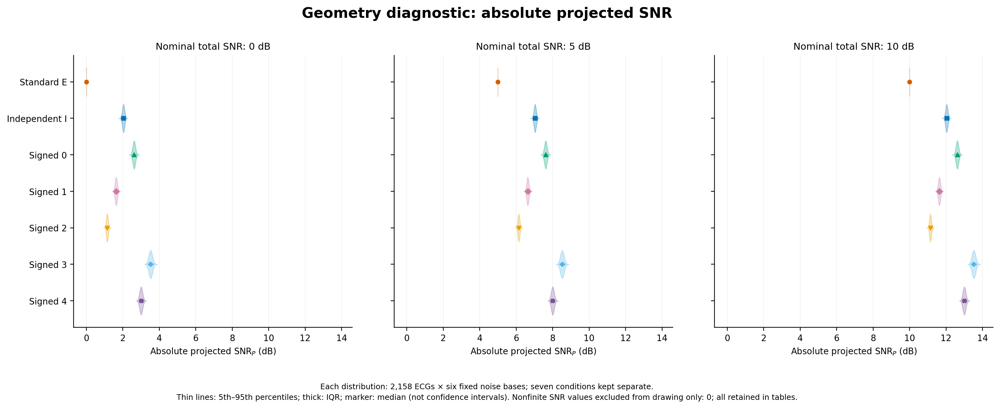
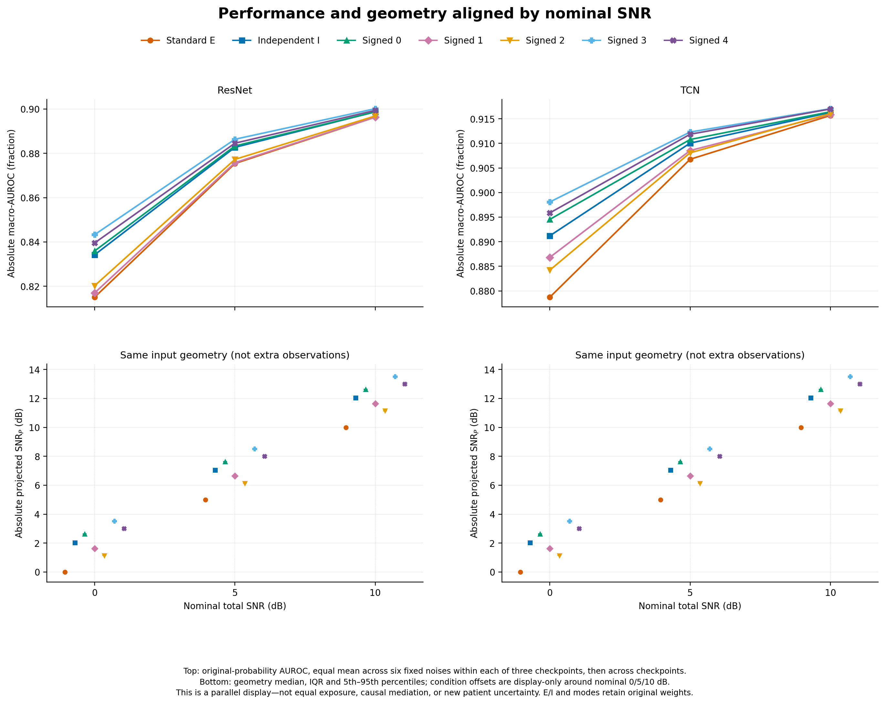
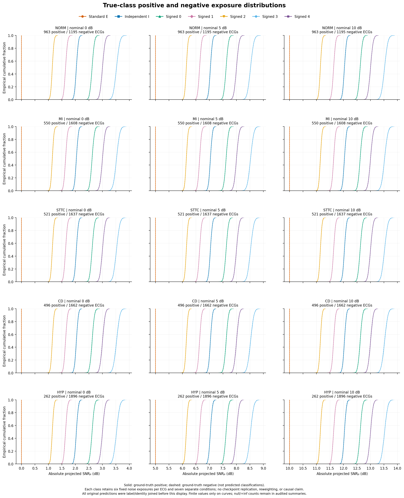

# ICASSP overnight supplement v2: paired protocol DiD and projected-SNR reanalysis

生成时间：2026-09-19T21:31:16.213564+00:00。基线提交 `79c9c3dc838ecaed7fe247f2f1f61c08cbab519c`。本报告仅包含通过独立复算与来源保护验收的新数字。

## 1. 发布状态与范围

- P0：`P0-COMPLETE`。Gaussian、heldout 组合、15/5 dB、ResNet/TCN、五个固定训练 seeds；仅 absolute macro-AUROC。未分析 train 组合。
- P1：几何层 `P1-GEO-DIRECT`；性能层 `P1-OVERLAY`。两层分别验收，不将分类预测作为几何量计算的先决条件。
- P2：独立概率/患者权重复算、独立 SVD 投影与来源保护通过。精确覆盖范围见第 5 节，不把抽查称作全体独立复算。
- P3：`DEFERRED — inventory only; no model execution performed.`
- `training_invocations = 0`；`inference_invocations = 0`。没有加载 checkpoint 做前向，没有新预测、阈值或 checkpoint 重选，没有新增 p 值或多重比较家族。

## 2. P0：完整四臂与配对差中差

第一个下标为训练策略，第二个为测试结构。E=electrode，I=independent-RMS。g_E=M_EE−M_IE，g_I=M_EI−M_II，Γ=g_E−g_I。正 Γ 表示 electrode training 相对优势在 E 测试结构中更大，不等于总体训练优势。

四臂 absolute AUROC 以百分数 (%) 展示；g、Γ、seed SD 与区间均为百分点 (pp)。原始 CSV 全部统一为 fraction。点估计来自全体测试患者，不是 bootstrap 均值。

| 架构 | SNR dB | M_EE % | M_IE % | M_EI % | M_II % | g_E pp | g_I pp | Γ pp | seed SD pp | 条件患者 95% CI pp | 有效/总 draws |
| --- | --- | --- | --- | --- | --- | --- | --- | --- | --- | --- | --- |
| resnet | 15 | 90.8030 | 90.6987 | 90.8245 | 90.7546 | 0.1044 | 0.0699 | 0.0345 | 0.0315 | [0.0161, 0.0551] | 2000/2000 |
| resnet | 5 | 89.4036 | 89.0993 | 89.8354 | 89.7495 | 0.3043 | 0.0859 | 0.2184 | 0.1629 | [0.1637, 0.2730] | 2000/2000 |
| tcn | 15 | 91.6426 | 91.6941 | 91.6657 | 91.7211 | -0.0515 | -0.0554 | 0.0039 | 0.0080 | [-0.0047, 0.0126] | 2000/2000 |
| tcn | 5 | 90.8442 | 90.6849 | 91.1572 | 91.2383 | 0.1593 | -0.0811 | 0.2404 | 0.0609 | [0.1980, 0.2867] | 2000/2000 |

### 固定训练 seeds 的 Γ

| 架构 | SNR dB | 17 pp | 29 pp | 43 pp | 101 pp | 202 pp |
| --- | --- | --- | --- | --- | --- | --- |
| resnet | 15 | 0.068116 | 0.056125 | 0.045130 | 0.008152 | -0.005138 |
| resnet | 5 | 0.254966 | 0.464489 | 0.231237 | 0.085428 | 0.056010 |
| tcn | 15 | 0.010094 | 0.010296 | 0.008005 | -0.007652 | -0.001217 |
| tcn | 5 | 0.155788 | 0.268315 | 0.201259 | 0.268955 | 0.307792 |

每个架构/SNR：50 个 combination×noise 单元；先在同 case、同 draw 作训练策略差，再等权聚合十个 heldout 组合与五个 noise bases，形成 seed 内 DiD，最后等权平均五个 seeds。seed SD 使用 ddof=1，与条件患者 CI 分开。共同患者 multiplicity 保留患者全部 ECG；缺类 draw 为 NaN，不重抽、不填零，只纳入五个 seed 均有效的 draw。

resnet 15 dB：条件患者区间未含零。 resnet 5 dB：条件患者区间未含零。 tcn 15 dB：条件患者区间包含零。 tcn 5 dB：条件患者区间未含零。 这些区间条件于固定 checkpoint、固定噪声和共同患者抽样，不覆盖训练随机性与噪声生成分布；不作新增显著性判断。

TCN 5dB 的均值训练排序反转：E测试下 g_E=0.1593pp，I测试下 g_I=-0.0811pp。 TCN15dB的两个训练对比均为负，且其Γ条件区间包含零；因此不能把评价协议依赖概括成所有条件下的训练优势。以上排序仅指五个固定seed的均值。

### 四臂身份规则

四臂共享 record_id、patient_id、标签、类别顺序、clean 身份、heldout combo、SNR、noise base 与患者抽样映射。同 E 测试结构内比较相同 X_E，同 I 结构内比较相同 X_I；不要求 X_E=X_I。同一训练策略跨测试结构保持 checkpoint 相同，不同训练策略 checkpoint 不同。原 phase2 diagnostics 未存逐记录 hash；本次从 immutable factorized cache 重建相同 normalized float32 输入，核对全数组 SHA，再记录逐记录 SHA。未保存新波形。

- [四臂来源索引](../did/four_arm_alignment.parquet)；[逐记录输入身份](../did/record_input_identity.parquet)；[case 明细](../did/did_long.csv)；[完整摘要](../did/did_summary.csv)；[患者 draw 审计](../did/did_draw_audit.parquet)。

## 3. P1：absolute projected SNR 几何诊断

路线 A：读取原始 immutable clean/base cache，在内存中按既有 float32 sign→scale→add 规则恢复最终输入 z；逐 case 与逐记录核对 SHA。实际噪声 n=float64(z)−float64(x)，用 float64、rcond=1e−12 构造 P=A A†，直接计算 SNR_P=10 log10(||Px||²/||Pn||²)。实际 total SNR 与 q 恒等式仅作交叉核验；没有用 nominal SNR 或报告四舍五入均值代替实际能量。

投影分子为零优先输出 null；非零分子、零分母输出 +inf；没有 epsilon、q 截断或异常置零。下面的 5%–95% 为记录/固定噪声暴露的描述性分位范围，**不是患者 CI**。六个固定 noise bases 各含相同记录数，合并分布给予其等权；五个模式分别显示，不视作随机独立重复。

| nominal dB | 结构 | mean SNR_P dB | median dB | P05–P95 dB | 暴露行数 | 唯一 ECG | 唯一患者 | 固定 noises | 异常 |
| --- | --- | --- | --- | --- | --- | --- | --- | --- | --- |
| 0 | E | -0.000006 | -0.000005 | [-0.000013, -0.000001] | 12948 | 2158 | 1877 | 6 | 0 |
| 0 | I | 2.037508 | 2.037042 | [1.937437, 2.137811] | 12948 | 2158 | 1877 | 6 | 0 |
| 0 | S_00 | 2.620013 | 2.619544 | [2.502700, 2.740448] | 12948 | 2158 | 1877 | 6 | 0 |
| 0 | S_01 | 1.636834 | 1.635639 | [1.537927, 1.739230] | 12948 | 2158 | 1877 | 6 | 0 |
| 0 | S_02 | 1.144605 | 1.143328 | [1.059752, 1.231391] | 12948 | 2158 | 1877 | 6 | 0 |
| 0 | S_03 | 3.526126 | 3.525941 | [3.362634, 3.691900] | 12948 | 2158 | 1877 | 6 | 0 |
| 0 | S_04 | 3.004608 | 3.003727 | [2.873185, 3.137729] | 12948 | 2158 | 1877 | 6 | 0 |
| 5 | E | 4.999994 | 4.999995 | [4.999987, 4.999999] | 12948 | 2158 | 1877 | 6 | 0 |
| 5 | I | 7.037508 | 7.037042 | [6.937437, 7.137811] | 12948 | 2158 | 1877 | 6 | 0 |
| 5 | S_00 | 7.620013 | 7.619544 | [7.502700, 7.740448] | 12948 | 2158 | 1877 | 6 | 0 |
| 5 | S_01 | 6.636834 | 6.635639 | [6.537927, 6.739230] | 12948 | 2158 | 1877 | 6 | 0 |
| 5 | S_02 | 6.144605 | 6.143328 | [6.059752, 6.231391] | 12948 | 2158 | 1877 | 6 | 0 |
| 5 | S_03 | 8.526126 | 8.525941 | [8.362634, 8.691900] | 12948 | 2158 | 1877 | 6 | 0 |
| 5 | S_04 | 8.004608 | 8.003727 | [7.873185, 8.137729] | 12948 | 2158 | 1877 | 6 | 0 |
| 10 | E | 9.999994 | 9.999995 | [9.999987, 9.999999] | 12948 | 2158 | 1877 | 6 | 0 |
| 10 | I | 12.037508 | 12.037042 | [11.937437, 12.137811] | 12948 | 2158 | 1877 | 6 | 0 |
| 10 | S_00 | 12.620013 | 12.619544 | [12.502700, 12.740448] | 12948 | 2158 | 1877 | 6 | 0 |
| 10 | S_01 | 11.636834 | 11.635639 | [11.537927, 11.739230] | 12948 | 2158 | 1877 | 6 | 0 |
| 10 | S_02 | 11.144605 | 11.143328 | [11.059752, 11.231391] | 12948 | 2158 | 1877 | 6 | 0 |
| 10 | S_03 | 13.526126 | 13.525941 | [13.362635, 13.691900] | 12948 | 2158 | 1877 | 6 | 0 |
| 10 | S_04 | 13.004608 | 13.003727 | [12.873185, 13.137729] | 12948 | 2158 | 1877 | 6 | 0 |



- [逐记录绝对 SNR_P 与能量](../snrp/snr_p_per_record.parquet)；[全部几何量摘要](../snrp/geometry_summary.csv)；[按 noise 分层](../snrp/geometry_by_noise.csv)。
- 几何异常行数：0；overlay 异常行数：0。边界定义与合成解析核验见 [boundary_cases.json](../snrp/boundary_cases.json)。

## 4. P1：既有性能曲线与类别暴露的并列展示

使用既有 E/I/五个 S 模式预测的原始概率复算 AUROC；曲线先等权平均六个固定 noise bases，再等权平均三个训练 checkpoints。各模式单独展示；E/I 不为五个模式复制权重。source_prediction_id 保留原始预测文件 SHA。756 个 noisy 来源各连接 2158 ECG，共 1,631,448 行；六个 clean 来源仅用于独立参考指标，不伪造 clean 几何 case。没有存储新的逐记录概率副本。



真实五类分别显示正/负例的几何暴露分布；多标签记录可属于多个正类，未把类别当作互斥分组，也未按模型/seed 重复计入同一几何暴露。



- [逐来源 AUROC](../snrp/auroc_overlay.csv)；[逐记录连接审计](../snrp/overlay_alignment.parquet)；[类别暴露分层](../snrp/class_exposure_summary.csv)。三个图均提供 PDF/PNG/SVG，版本与哈希见 [figure_manifest.json](../snrp/figure_manifest.json)。

### 对原解释的限制

相同 nominal total SNR 不代表相同 projected SNR。E/S/I 的性能排序与几何暴露可以并列观察，但本轮没有控制投影暴露后的 AUROC 估计量，不能据此证明独立于子空间暴露差异的方向效应，不能声称因果中介、等效性或真实硬件效应。既有 signed-control 的固定映射、100 Hz PTB-XL、Gaussian、两个网络边界不扩大；新几何量不是完整生理合理性度量。未做分箱标准化、重加权 AUROC、propensity、等暴露曲线或中介分解。

## 5. P2 独立复算与异常审计

- P0：从4000原始 NPZ 独立计算1000组四臂 full-cohort point 与 draw0/1999，核验首尾固定 QA units、四个总体组及20个 seed 组。使用独立正负样本加权计数与半权 ties，不调用生产 AUROC/聚合函数。最大绝对误差 `1.7542391150815462e-15`；比较数 `399518`。其余1998draw 检查缺类有效性、NaN、seed平均、差值和 percentile 一致性，未声称逐概率独立重算全部draw。
- P1：固定记录 `[9, 38, 40, 57, 59]` ×126cases=630条独立重建，独立 SVD 子空间投影；完整271908行几何主键/hash覆盖，1,631,448行overlay连接审计。42个预定noisy来源与6个clean参考独立复算AUROC，九个解析边界case。检查数 `133`，失败数 `0`。
- 来源保护：重新核对 `5179` 个实际消费的历史本地来源字节及 SHA，失败 `0`。不将此声称为对磁盘所有未消费文件的全量哈希。
- [P0 独立证据](../qa/did_recompute.json)；[P1 独立证据](../qa/snrp_recompute.json)；[来源保护](../qa/source_protection.json)；[逐项发布清单](../qa/release_checklist.md)。

## 6. 资源、环境与未执行项目

预冻结代表分片：读文件 0.003819s；macro-AUROC 0.002901s；一次共同患者 draw 0.002851s；2158记录投影扫描 0.502952s。OS缓存状态未受控，不声称冷缓存吞吐。P0四个worker、P1一个worker，BLAS均为1；GPU不参与。

实际数值生产耗时：P0来源/身份可用性判定 126.225s，2000draw计算 668.102s；P1纠错后完整生产 118.687s。P0独立复算 41.016s。这些是各阶段实测elapsed，不与OS冷缓存或未来GPU训练吞吐等同。

发布时仅调整连接 Parquet 的无损编码布局：143,811,089→64,249,453 bytes，756→12 row groups。全部 1,631,448×22 个表格单元、类型、null 和行序经 Arrow 精确相等核验；原始数据和全部数值 CSV 不变，独立 P1 QA 在最终文件上再次通过。见 [lossless_alignment_pack.json](../qa/lossless_alignment_pack.json)。

独立 SVD 复算的 absolute SNR_P 最大绝对误差为 4.263256414560601e-14 dB，低于预定1e−10 dB绝对容差；能量项使用预定1e−12相对容差，不混用绝对误差门。逐指标误差见独立 QA 和 release checklist。

T+60/T+90仅为数据可用性/资源门，不是科学门；提前发现所有必需预测与 cache，详见 [resource_gates.json](../freeze/resource_gates.json)。运行时间不作为科学失败条件。

Python：`3.10.19 | packaged by Anaconda, Inc. | (main, Oct 21 2025, 16:41:31) [MSC v.1929 64 bit (AMD64)]`。包版本：`{"matplotlib": "3.10.9", "numpy": "2.2.6", "pandas": "2.3.3", "pyarrow": "21.0.0", "scikit-learn": "1.7.2", "scipy": "1.15.3"}`。Parquet支持单独安装于本轮 shared/vendor，旧虚拟环境未修改。初始基准脚本使用当前Python不支持的hashlib.file_digest，已在产生基准结果前改为流式SHA-256；原始失败和修复记录保留于 [runtime_setup.json](../freeze/runtime_setup.json)。

本轮首次 overlay 审计曾误拒绝54个来源：legacy run_fingerprint 在两个 ResNet 分片间共享，单值字典覆盖了一个分片。已改为 fingerprint×model×owned_case_id 联合匹配并要求唯一所有者，保留原有全部 hash/标签/checkpoint 检查。修复后762来源（其中756 noisy）全部连接通过，独立验收失败为0；初次失败快照和纠错证据保存在 [p1_correction_record.json](../qa/p1_correction_record.json)。这是本轮审计实现错误，不是原始预测/输入身份冲突；失败的 overlay 未获发布，历史工件未修改。

P3仅静态清点：[tsai InceptionTime](https://github.com/timeseriesAI/tsai/blob/bbb61982741d466bfa81669edc0e17f1971980af/tsai/models/InceptionTime.py)，公开commit `bbb61982741d466bfa81669edc0e17f1971980af`、Apache-2.0；未导入模型、forward/backward、GPU smoke或epoch计时。详见 [gate0_status.md](../third_architecture/gate0_status.md)。

## 7. 可复现路径与内容身份

- source manifest SHA-256：`24d674f895dfc8bf23e95dbc3c07427ae4e541862e612918afa13b9ae8dbb27d`，文件 [source_manifest.json](../freeze/source_manifest.json)。
- code manifest SHA-256：`8aaf2c1857b08ffab5a84bbe643d3ed2fdbf75a7877083160575fe150503621a`，文件 [code_manifest.json](../freeze/code_manifest.json)。
- 全部新增代码与输出位于 `overnight_supplements_v2/`；旧来源只读。原始波形、输入cache、逐记录概率与 isolated vendor 不进入本次Git提交。
- 推送commit SHA属于外层Git发布证据，最终返回单独给出，不在提交自身内容中递归嵌入自身SHA。

在仓库根目录、原始本地工件就位后执行（始终设置 PYTHONDONTWRITEBYTECODE=1 与 OMP/OPENBLAS/MKL/NUMEXPR_NUM_THREADS=1）：

```text
python -B -m pip install --no-deps --target overnight_supplements_v2/shared/vendor pyarrow==21.0.0
python -B -m overnight_supplements_v2.did.pipeline --run
python -B -m overnight_supplements_v2.snrp.run --run
python -B -m overnight_supplements_v2.qa.did_recompute
python -B -m overnight_supplements_v2.qa.snrp_recompute
python -B -m overnight_supplements_v2.freeze.finalize_sources --seal
python -B -m overnight_supplements_v2.freeze.finalize_sources --verify
python -B -m overnight_supplements_v2.reports.build_report
```

复跑会更新本轮隔离目录的派生结果，不能覆盖任何历史来源；需要保存本轮发布快照时先另建新的隔离副本。

## 8. 论文插入文字（仅已验收数字）

In an exploratory paired difference-in-differences analysis restricted to held-out electrode-support combinations and 15/5 dB Gaussian perturbations, we compared electrode versus independent-RMS augmentation under electrode and independent-RMS testing. RESNET at 15 dB: DiD 0.0345 pp, seed SD 0.0315 pp, conditional patient 95% interval [0.0161, 0.0551] pp; RESNET at 5 dB: DiD 0.2184 pp, seed SD 0.1629 pp, conditional patient 95% interval [0.1637, 0.2730] pp; TCN at 15 dB: DiD 0.0039 pp, seed SD 0.0080 pp, conditional patient 95% interval [-0.0047, 0.0126] pp; TCN at 5 dB: DiD 0.2404 pp, seed SD 0.0609 pp, conditional patient 95% interval [0.1980, 0.2867] pp. Each result averages five fixed training seeds, ten held-out combinations and five noise bases; the conditional intervals use 2,000 common patient-cluster multiplicity draws over 2,158 ECGs from 1,877 patients. For TCN at 5 dB, the mean training contrast reversed from 0.1593 pp under E testing to -0.0811 pp under I testing. Separately, direct float64 projection of the reconstructed, hash-verified signed-control inputs yielded the following mean absolute projected SNRs at nominal 0 dB: E: -0.000006 dB; I: 2.037508 dB; S_00: 2.620013 dB; S_01: 1.636834 dB; S_02: 1.144605 dB; S_03: 3.526126 dB; S_04: 3.004608 dB. The geometry and the unchanged prediction-derived AUROC curves are displayed side by side, without exposure adjustment, equivalence claims or causal mediation interpretation.
