# 第一阶段最终报告：面向采集机制一致扰动的多导联ECG鲁棒性实验

项目：`E:/Eproject/ECG/phase1_ecg_robustness/`。数值与结论来自已完成、统一确定性FP32的实际结果及本次审阅补充；未执行的第二阶段事项仅列为建议，不混写成结果。归档的旧精度结果不参与结论。

## 1. 结论与适用范围

**在PTB-XL五类诊断、100Hz、当前两种clean-only模型上，强合成噪声（0dB）下，独立导联噪声相对电极诱导结构噪声给出更乐观的鲁棒性估计。** Electrode−independent_rms的Macro-AUROC差为ResNet **−0.02075**、TCN **−0.01269**；新增2000次患者簇bootstrap的95%CI分别为**[−0.02472,−0.01660]、[−0.01560,−0.00963]**。这些区间条件于三份固定训练模型和base8128逐记录噪声，不是训练/噪声/患者联合区间；原训练种子均值、SD和t区间完整保留。

新增循环移位对照保留逐导联经验幅度分布和全记录周期谱后，0dB的electrode−marginal_shift差仍为ResNet **−0.01804**、TCN **−0.01350**，患者95%CI分别为[−0.02232,−0.01383]、[−0.01636,−0.01037]。两种主对照在新增五个noise base中，各模型的15个训练×噪声组合均为负。**这增强了当前强合成扰动下的条件性证据，不证明“只改变零时滞协方差”的唯一因果作用**：移位仍改变跨导联相位/时滞关系，普通短窗Welch谱并非完全匹配。

不支持普遍临床偏差、所有SNR下方向一致或电极生成路径本身有额外作用。20dB接近零；TCN10dB的新增患者AUROC区间包含零，且噪声实现敏感。NSTDB明确属于存在混杂的敏感性回放。协方差对照与映射接近，是二阶结构解释的支持证据，不是等价检验结论。

“Clean”仅表示未额外加噪，并不保证原始ECG无伪差。这里的“偏差”指相对于另一受控扰动集合的估计差异，不是对未知真实临床采集噪声分布的统计偏差估计。0dB是强压力条件，不代表其临床发生频率。

### 实际完成范围

|阶段|训练|测试记录/患者|主评估组数|状态|
|---|---|---|---:|---|
|smoke|ResNet，1种子×1epoch|100/91|16|五阶段exit0|
|pilot|ResNet，3种子×15epochs|1000/896|39|五阶段exit0，精度修正后重算|
|full|ResNet+TCN，各3种子×25epochs|2158/1877|456|五阶段exit0|
|pilot噪声重复|复用三份checkpoint；5个额外噪声种子|1000/896|180|完成|
|full噪声重复|复用六份checkpoint；5个额外噪声种子|2158/1877|360|完成|
|审阅补充|复用full六份checkpoint；无新增训练|2158/1877|108|三阶段exit0；另完成患者CI与822份旧预测核验|

仍为10次实际训练、196个完整epoch；原1051份预测加108份严格对照，共**1159个NPZ预测文件、2,214,592条记录×模型×条件预测**，不是这么多独立受试者。Full456组=6个clean组+288个全节点噪声组+162个单电极组；其原1332行配对表与11张PNG保留。本次另交付6240行AUROC区间、2000×6240分布数组、11张PNG及11张PDF。未执行500Hz、外部数据、真实设备故障或第二阶段鲁棒训练。

## 2. 数据、来源、许可与任务

### 2.1 数据来源

- **PTB-XL1.0.3**：[PhysioNet官方页面](https://physionet.org/content/ptb-xl/1.0.3/)，CC BY4.0；主实验下载了完整100Hz波形，不含500Hz版本。论文：[Wagner等，Scientific Data 2020](https://www.nature.com/articles/s41597-020-0495-6)。
- **MIT-BIH Noise Stress Test Database1.0.0**：[官方页面](https://physionet.org/content/nstdb/1.0.0/)，Open Data Commons Attribution License1.0；实际下载并使用bw/ma/em。MIT-BIH Arrhythmia并非本次分类主数据集。
- 波形由WFDB4.3.1解析：[WFDB项目](https://wfdb.io/)。下载/预处理说明、引用与外部目录参数见 [`../data/README.md`](../data/README.md)。
- 原始目录：`data/raw/ptb-xl-1.0.3/`、`data/raw/nstdb/`；完整缓存：`data/processed/`。下载清单为 `data/download_manifest.json` 和同目录inventory JSONL：43610个本地文件、43607个已验证文件、557137575字节、errors为空。文件计数包含元数据/源文件等不同类别，以清单为准，不把计数差异视为缺失波形。官方ZIP条目校验和本地SHA256/大小记录保留。

### 2.2 标签与划分

使用SCP diagnostic==1代码的diagnostic_class映射为 `NORM, MI, STTC, CD, HYP`，五维多标签而非互斥五分类。按[官方示例](https://physionet.org/files/ptb-xl/1.0.3/example_physionet.py)读取所有诊断代码键；**likelihood0表示未知，而非阴性**，没有错误过滤为 `>0`。411条无目标superclass记录被显式排除；没有把全零目标混入正常类，也未做标签置信度敏感性实验。

|划分|记录|患者|NORM|MI|STTC|CD|HYP|
|---|---:|---:|---:|---:|---:|---:|---:|
|原始全集|21799|18869|—|—|—|—|—|
|保留全集|21388|18617|9514|5469|5235|4898|2649|
|train，fold1–8|17084|14823|7596|4379|4186|3907|2119|
|validation，fold9|2146|1917|955|540|528|495|268|
|test，fold10|2158|1877|963|550|521|496|262|

原始队列、保留队列与10份checkpoint划分均检查了患者不跨分区；一位患者仍可在本分区内有多条ECG，所以推断不能把记录全当独立患者。统计和标签共现分别在 `results/tables/dataset_summary.csv`、`dataset_leakage.json`、`dataset_cooccurrence.json`。

审阅补充从官方元数据独立重算标签，逐一对齐三个缓存的记录顺序、标签、患者和fold：21799−411=21388。411条均为无目标诊断superclass；不可用波形、预处理失败、重复过滤、质量注释过滤和额外标签阈值过滤均为0。这里“0”表示没有这些排除操作或失败，不代表原始信号没有伪差。正确口径是**遵循官方strat_fold的21388条保留分析队列**，不是不经排除的官方原始全集。完整21799行的原因清单及来源证据在 `results/tables/review_supplement/data_record_audit.csv`、`data_audit.json`；本次复核存在性和历史已校验库存，未再次重算每个原始波形的SHA256。

Smoke使用官方元数据前1000条中的988条有效记录，固定256/100/100。Pilot使用前10000条中的9865条有效记录，候选分区7685/1074/1106，再用subset_seed2026选4000/1000/1000。**候选前缀不是完整库均匀抽样。** Pilot与full同时改变训练规模、训练时长和测试队列，不能只用“样本量增加”解释结果变化。

保留全集的标签共现计数如下，对角线为正样本数。MI/CD共现1794条、STTC/HYP共现1509条；NORM也可与其它官方映射标签共现（例如CD415条），没有强行改成互斥分类或人为删掉这些记录。标签语义/置信度敏感性留待后续验证。

|标签|NORM|MI|STTC|CD|HYP|
|---|---:|---:|---:|---:|---:|
|NORM|9514|1|33|415|5|
|MI|1|5469|1339|1794|818|
|STTC|33|1339|5235|1066|1509|
|CD|415|1794|1066|4898|787|
|HYP|5|818|1509|787|2649|

### 2.3 预处理

所有保留记录为12导联、100Hz、1000点/10秒、mV、有限值；按标准顺序重排。每记录每导联只去时间均值，不滤波、不裁剪、不逐导联标准化。完整训练集拟合唯一全局RMS标量 **0.2254905872mV**；先在mV空间加噪，再把clean/noisy都除以该标量。验证和测试不参与拟合。

这避免逐导联标准化悄悄改变A诱导结构；但去均值会去掉记录内DC，且100Hz不能验证50Hz以上的高频噪声保真。保存 `signals.npy`、`labels.npy`、`metadata.csv`、`preparation.json`，形状为(21388,12,1000)/(21388,5)。

## 3. 电极—导联矩阵：定义、修正与边界

电极节点 `e=(RA,LA,LL,V1,…,V6)`；输出导联 `y=(I,II,III,aVR,aVL,aVF,V1,…,V6)`，`y=Ae`。实际代码：`src/lead_matrix.py`。

```text
B = [ -1     1     0
      -1     0     1
       0    -1     1
       1    -1/2  -1/2
      -1/2   1    -1/2
      -1/2  -1/2   1 ]

A = [ B                         0_(6×6)
      -(1/3) × ones_(6×3)      I_(6×6) ]     (12×9)
```

标准关系：I=LA−RA，II=LL−RA，III=II−I；aVR=−(I+II)/2，aVL=I−II/2，aVF=II−I/2；胸前导联为Vi−WCT，WCT=(RA+LA+LL)/3。**Guidance示例矩阵的胸前前三项+1/3与其公式矛盾，本实现修正为−1/3。**

验证包括维度、rank8、`A×ones(9)=0`、Einthoven/增强肢体关系、WCT、单位电极传播，以及可选12×10矩阵的零RL列。单个RA/LA/LL扰动各影响11个导联，分别不影响III/II/I；单个胸前节点只直接影响对应胸导联。RL零列不代表模拟了右腿驱动反馈。

这些关系约束的是**新增扰动**；没有从PTB-XL反演真实电极电势，也没有要求原始临床波形严格满足无设备差异的理想映射。理想节点协方差为σ²I时，映射噪声协方差为σ²AAᵀ；不能把rank8带来的结构当成“少了四个独立导联信息”的临床诊断结论。

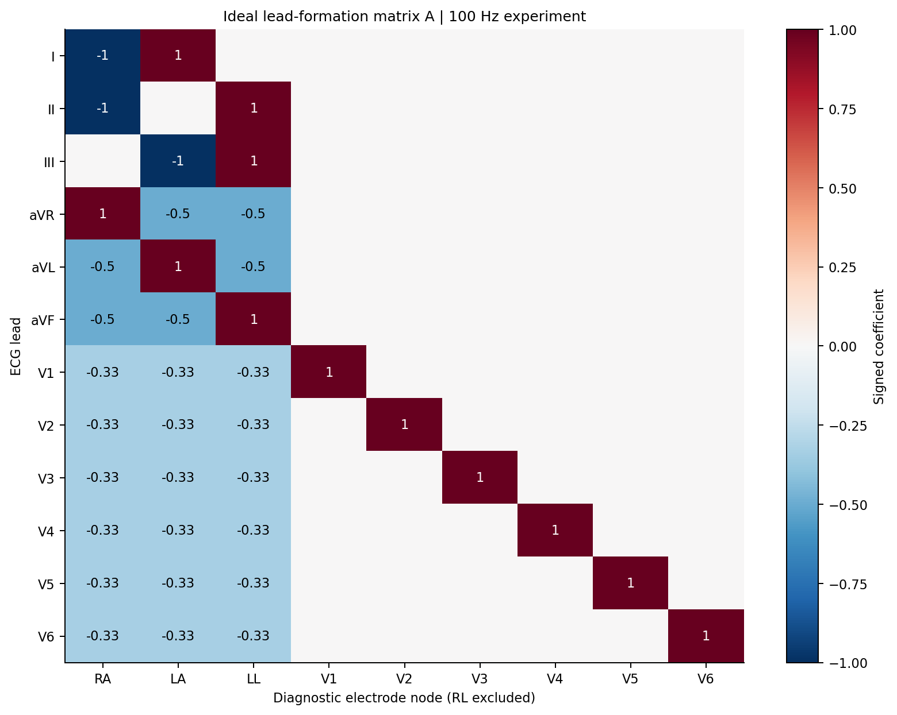

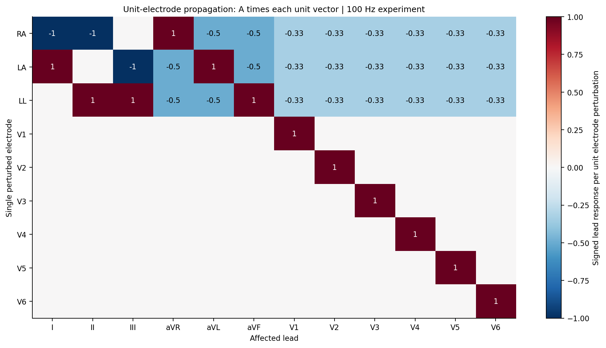

## 4. 噪声机制与公平控制

### 4.1 四个条件

|条件|生成|对齐|边界|
|---|---|---|---|
|independent|导联空间独立时间实现|逐记录全局SNR|不保证每导联RMS与映射条件相同|
|electrode|9节点生成，再通过A|逐记录全局SNR|保持映射结果，不逐导联修改物理参考|
|independent_rms|保留independent的时间实现，逐导联缩放|映射条件的12个RMS精确匹配，因此全局SNR也匹配|匹配幅度，不匹配跨导联协方差|
|covariance|fresh导联空间样本，经验白化后按目标经验协方差着色|每条记录的Cov(Aε)，ddof0|共享有限样本协方差；不宣称任意类型高阶/时间分布相同|

全局功率 `P(x)=mean(x²)`，覆盖整条记录12×1000点。原噪声n0按 `alpha=sqrt(P(x)/(10^(SNR/10)*P(n0)))` 缩放。目标20/10/0dB。这里的SNR相对于去均值输入总体功率，不是潜在无伪差心电与全部设备噪声的真实SNR。

协方差着色使用对称特征分解、只截断舍入级负/极小特征值，无额外jitter；秩亏目标被保留。经验协方差匹配会把两条件耦合；分类器只看到最终输入，不能从相近输出推论存在独立于输入分布的“电极生成路径效应”。有限记录和强度条件化也不能等同未经条件化的无限Gaussian过程。

### 4.2 时间基底与随机性

- 主合成基底：矩形FFT带限Gaussian，0.5–40Hz，统一采样率100Hz。共享频带/总体谱模板，并非逐记录逐频点PSD相等；FFT边界有周期假设。
- NSTDB：bw基线漂移、ma肌电伪差、em电极运动。原始双通道360Hz经 `resample_poly(5,18)` 到100Hz，随机通道/连续10秒片段，去均值后缩放。独立抽样片段不保证短窗口经验相关很小；它也不是9个真实电极的原始观测。
- 重采样细节由实际SciPy1.15.3实现核验：Kaiser β=5的361-tap对称低通FIR；5倍上采样网格1800Hz，归一化截止1/18对应50Hz，滤波器增益乘5；前补18个滤波系数零、裁去11个初始输出样本补偿延迟，边界为常数零。它有有限过渡带，不是理想砖墙抗混叠。源码/签名/哈希和各原始噪声文件哈希见 `results/tables/review_supplement/sampling_protocol.json`。ECG直接使用官方100Hz文件，没有对ECG另行重采样；**500Hz敏感性实验未做**。
- 主噪声base8128，由ecg_id/kind派生，独立于训练种子；同记录跨模型/训练种子使用相同噪声。先生成0dB实例，再缩放10/20dB，避免把实现变化误认为SNR效应。
- 追加base101/202/303/404/505，仅针对合成主噪声；每个base均跑四条件×三SNR。没有追加训练，也没有给NSTDB或九电极扩展做五重复。
- 单电极扩展：RA/LA/LL/V1–V6，10dB，映射/RMS匹配/协方差三条件。相同全局SNR使单胸前导联局部噪声更集中，不等于各电极相同原始电势幅度，更不等于真实故障概率。

### 4.3 先验噪声检查与实测强度

128条固定**验证**ECG上的门槛与诊断先于模型结论；不在test上调整模型。下表PSD为记录和导联聚合Welch谱相对映射条件的L1差，不是单条记录/单导联的最大误差。

|噪声|independent绝对非对角相关均值|electrode相关均值|RMS独立/协方差相对PSD L1|结构隔离诊断|
|---|---:|---:|---|---|
|bandpass|0.02854|0.19747|2.40% / 2.96%|通过|
|bw|0.40532|0.49803|18.17% / 3.35%|未通过；仅探索性|
|ma|0.24514|0.38583|20.45% / 14.39%|未通过；仅探索性|
|em|0.24697|0.44652|24.41% / 4.73%|未通过；仅探索性|

合成独立条件的PSD差为2.37%；RMS匹配2.40%、协方差匹配2.96%。其协方差相对Frobenius误差均值1.357e−15（float64审计）。`noise_gate.json`的数值硬门槛全部通过；**NSTDB的strict_structure_control均为false**，故临床回放只作探索性性能比较，不作纯相关结构因果解释。没有通过强行白化真实噪声来制造“独立相关必须近零”的假通过。

在实际full测试NPZ中，最大SNR误差 **2.0085e−7dB**，RMS匹配最大相对误差 **1.9343e−8**，未受扰导联噪声RMS严格为零；其lead_snr为+inf是有意义的定义，不是模型指标NaN。原始强度、PSD/频带功率、协方差/相关数据在 `results/tables/full/noise_*.csv`，逐记录强度在预测NPZ。

实际full测试的逐导联强度示例：bandpass、全局10dB、base8128，2158条记录；噪声跨模型/训练种子相同，取ResNet seed17文件提取。SD与分位数是跨记录分布，不是种子误差。independent_rms的逐导联RMS/SNR与映射条件匹配；下表同时保留未做RMS匹配的原independent幅度，展示全局等能量不等逐导联等能量。完整精度见 `results/tables/full/test_noise_lead_distribution.csv`。

|导联|原independent平均RMS mV|electrode RMS均值±SD mV|electrode实际导联SNR：P5/中位/P95 dB|
|---|---:|---:|---|
|I|0.06707|0.07633 ± 0.03287|-0.68 / 5.59 / 10.47|
|II|0.06710|0.07635 ± 0.03291|-0.13 / 6.03 / 9.98|
|III|0.06703|0.07635 ± 0.03282|-2.11 / 4.34 / 10.47|
|aVR|0.06709|0.06611 ± 0.02850|0.46 / 6.38 / 9.88|
|aVL|0.06703|0.06611 ± 0.02843|-2.76 / 4.51 / 10.47|
|aVF|0.06705|0.06613 ± 0.02846|-1.58 / 5.02 / 10.42|
|V1|0.06692|0.06239 ± 0.02682|3.48 / 8.95 / 14.09|
|V2|0.06710|0.06236 ± 0.02688|7.17 / 13.10 / 16.98|
|V3|0.06701|0.06233 ± 0.02675|8.28 / 13.09 / 16.23|
|V4|0.06700|0.06238 ± 0.02698|7.17 / 12.69 / 15.68|
|V5|0.06698|0.06235 ± 0.02688|6.82 / 11.87 / 15.12|
|V6|0.06707|0.06235 ± 0.02692|5.26 / 10.17 / 14.90|

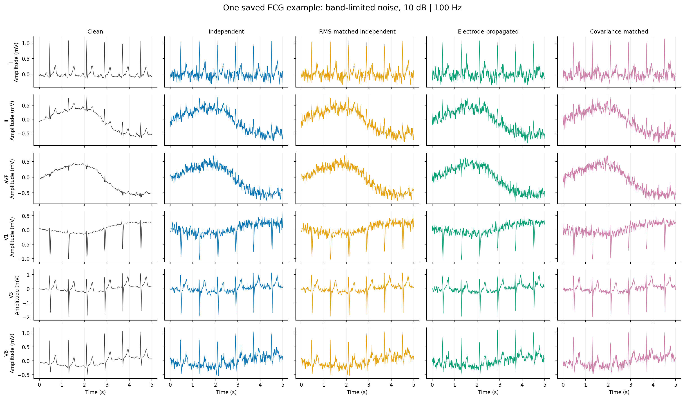

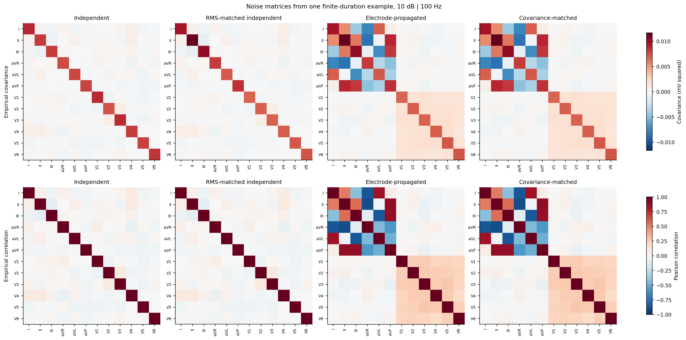

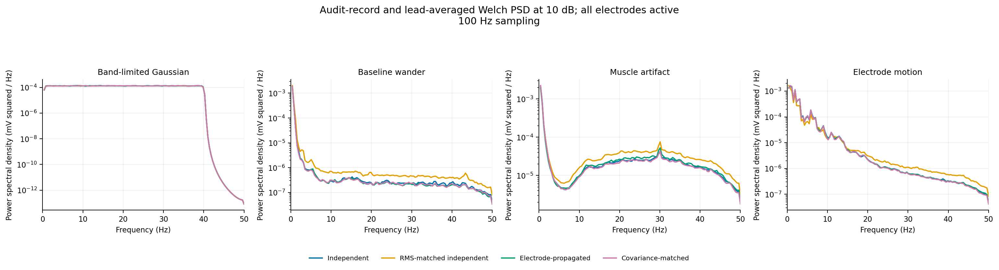

## 5. 模型、训练与运行环境

|构型|结构|参数数|归一化/边界|
|---|---|---:|---|
|ResNet|1D ResNet18风格，2/2/2/2残差块，base24|545717|BatchNorm，全局池化|
|TCN|6残差块，通道24/24/48/48/96/96；每块两层kernel3，dilation1/2/4/8/16/32|134885|GroupNorm(1,C)，dropout0.1，全局池化|

TCN卷积部分感受野253样本；左填充卷积不使整个模型成为在线因果模型，因为GroupNorm及池化使用全窗口。两构型参数量、归一化和正则化不同，排名仅针对这两个实现，不能隔离一般架构因果优劣。

全部clean-only，BCEWithLogitsLoss、AdamW、lr0.001、weight_decay0.0001、batch128。Pilot15epochs，full25epochs，seed17/29/43；不进行扰动增强训练。按clean-validation Macro-AUROC选择best checkpoint，各类F1阈值也只从验证集选择，平局取最接近0.5；noisy/test固定阈值。

Full六次25epoch训练全部完成，而不是用中途checkpoint充数。例：ResNet seed17最佳epoch4、val AUROC0.914003；epoch25 train loss0.0444/val loss0.7317，存在过拟合，但实际使用best而非last。TCN seed17最佳epoch23、val AUROC0.923352；不能把低训练loss等同更好鲁棒性。每epoch轨迹与best/last权重均保留。

运行于Windows11、Ryzen9 7940HX、RTX4070 Laptop8GB；Python3.10.19、Torch2.5.1+cu121、cuDNN90100、NumPy2.2.6、SciPy1.15.3、pandas2.3.3、scikit-learn1.7.2、WFDB4.3.1。项目虚拟环境只读复用已有inpaint的Torch/NumPy，其余依赖安装在项目内，未修改原环境。DGX DNS和历史IPv6连接均失败，全部计算在本机完成。

训练、验证、主评估与重放禁用cuDNN/矩阵乘TF32，启用确定性算法，`CUBLAS_WORKSPACE_CONFIG=:4096:8`。完整full流水线约108分钟：训练6031.35秒、主评估353.87秒、统计71.20秒、绘图8.13秒；各阶段exit0，见 `results/logs/full/run_status.json`。当前硬件/包清单和nvidia-smi输出保留在 `results/logs/`、`requirements-lock.txt`。

## 6. 指标与统计方法

- 主指标：record-level macro-AUROC、macro-AP（average precision）、macro-F1；附micro与逐类指标。
- 校准/稳定性：Brier、每类15个等宽bin ECE再平均、预测熵、平均二元置信度mean(max(p,1−p))、与clean的固定阈值二元一致率、平均概率变化。高置信度不是准确率。
- 种子汇总：三个训练种子的均值、样本SD、df2的Student-t95%CI，不截到[0,1]，不把3个种子伪装大样本。配对AUROC差在每训练种子内先相减再汇总；这些CI不是患者bootstrap。
- 新增患者级AUROC：均匀有放回抽1877名患者，保留其全部ECG并使用抽中次数加权，重算记录级AUROC；每次分别计算三个固定种子的AUROC后平均，绝不平均概率构造ensemble。所有模型/类别/SNR/条件共享2000次抽样，seed20260917，百分位95%CI；绝对值、clean下降量及配对差异均保存。它与下面的患者等权BCE是不同estimand，详见§14.2。
- 患者loss/probability推断：同记录差异先跨训练种子平均，再在患者内平均，最后对患者等权；2000次患者bootstrap、10000次符号翻转置换（对应对称性零假设），报告均值差、95%CI、dz=患者差异均值/样本SD。
- Full主loss比较的Holm家族有72项：3种噪声间比较×2模型×4噪声类型×3SNR，限all-active；pilot为9项。最小原始Monte Carlo p=1/10001，full最小Holm p=72/10001=0.007199。不能写作p<1e−4。Noisy−clean、概率、类别和单电极分析为探索性，未给予同等确证性显著性解释。
- 追加五噪声重复：先在每noise base内平均三个训练种子差，再报告五次均值/SD/范围。是交叉设计，不是15份独立训练；未构造患者/训练/噪声三层联合CI。
- 只有两个架构的Spearman/Kendall排名是描述性；不以两个点的±1作为普遍排名反转证据。

患者CI条件于当前模型与噪声，种子CI条件于当前测试队列与主噪声，二者不是同一不确定性。下节mean_loss按记录平均，与患者等权ΔBCE不必等于直接相减。完整表和统计协议在 `results/tables/full/`。

## 7. 主合成噪声结果

### 7.1 Macro-AUROC

审阅补齐的合成Gaussian主表同时列出全部20/10/0dB、原四条件及新 `marginal_shift`。测试2158记录/1877患者；主结果固定noise base8128。**训练t区间、患者条件区间和噪声重放SD分列，不能互换。** Noise replay先在每个base内平均三训练种子，再对101/202/303/404/505五次取均值和样本SD；不含8128，也不是15次独立训练。Clean在CSV以snr=100作内部标记，不是100dB扰动。

|模型|SNR|条件|AUROC训练均值±SD [训练95%CI]|AUROC患者95%CI|clean下降均值±SD|归一化均值|五次noise replay均值±SD|
|---|---:|---|---|---|---|---:|---|
|resnet|—|clean|0.90783 ± 0.00091 [0.90558, 0.91009]|[0.90019, 0.91507]|0.00000 ± 0.00000|1.00000|—（重用clean）|
|resnet|20|independent|0.90696 ± 0.00128 [0.90378, 0.91013]|[0.89925, 0.91423]|0.00088 ± 0.00038|0.99903|0.90675 ± 0.00028|
|resnet|20|independent_rms|0.90692 ± 0.00128 [0.90373, 0.91010]|[0.89920, 0.91418]|0.00092 ± 0.00038|0.99899|0.90675 ± 0.00028|
|resnet|20|electrode|0.90639 ± 0.00131 [0.90313, 0.90964]|[0.89865, 0.91373]|0.00145 ± 0.00049|0.99841|0.90659 ± 0.00030|
|resnet|20|covariance|0.90678 ± 0.00122 [0.90375, 0.90982]|[0.89906, 0.91407]|0.00105 ± 0.00035|0.99884|0.90653 ± 0.00020|
|resnet|20|marginal_shift|0.90656 ± 0.00133 [0.90326, 0.90987]|[0.89871, 0.91401]|0.00127 ± 0.00044|0.99860|0.90685 ± 0.00018|
|resnet|10|independent|0.89933 ± 0.00397 [0.88946, 0.90920]|[0.89130, 0.90703]|0.00850 ± 0.00308|0.99063|0.89881 ± 0.00046|
|resnet|10|independent_rms|0.89909 ± 0.00408 [0.88895, 0.90923]|[0.89107, 0.90687]|0.00874 ± 0.00318|0.99037|0.89863 ± 0.00046|
|resnet|10|electrode|0.89571 ± 0.00430 [0.88503, 0.90638]|[0.88755, 0.90376]|0.01213 ± 0.00349|0.98664|0.89642 ± 0.00069|
|resnet|10|covariance|0.89604 ± 0.00415 [0.88573, 0.90636]|[0.88775, 0.90403]|0.01179 ± 0.00334|0.98701|0.89612 ± 0.00027|
|resnet|10|marginal_shift|0.89811 ± 0.00329 [0.88994, 0.90628]|[0.88989, 0.90614]|0.00972 ± 0.00241|0.98929|0.89889 ± 0.00029|
|resnet|0|independent|0.83687 ± 0.01520 [0.79912, 0.87463]|[0.82680, 0.84624]|0.07096 ± 0.01431|0.92182|0.83475 ± 0.00037|
|resnet|0|independent_rms|0.83601 ± 0.01528 [0.79806, 0.87396]|[0.82593, 0.84549]|0.07183 ± 0.01438|0.92087|0.83382 ± 0.00024|
|resnet|0|electrode|0.81526 ± 0.01557 [0.77657, 0.85394]|[0.80472, 0.82527]|0.09258 ± 0.01467|0.89801|0.81502 ± 0.00059|
|resnet|0|covariance|0.81435 ± 0.01598 [0.77464, 0.85405]|[0.80394, 0.82397]|0.09349 ± 0.01508|0.89701|0.81349 ± 0.00118|
|resnet|0|marginal_shift|0.83329 ± 0.01288 [0.80131, 0.86528]|[0.82322, 0.84279]|0.07454 ± 0.01197|0.91788|0.83349 ± 0.00103|
|tcn|—|clean|0.91886 ± 0.00273 [0.91209, 0.92564]|[0.91119, 0.92608]|0.00000 ± 0.00000|1.00000|—（重用clean）|
|tcn|20|independent|0.91868 ± 0.00271 [0.91194, 0.92542]|[0.91104, 0.92595]|0.00018 ± 0.00005|0.99980|0.91864 ± 0.00003|
|tcn|20|independent_rms|0.91867 ± 0.00272 [0.91190, 0.92543]|[0.91101, 0.92594]|0.00019 ± 0.00003|0.99979|0.91864 ± 0.00004|
|tcn|20|electrode|0.91860 ± 0.00270 [0.91189, 0.92532]|[0.91104, 0.92580]|0.00026 ± 0.00018|0.99972|0.91875 ± 0.00014|
|tcn|20|covariance|0.91873 ± 0.00273 [0.91195, 0.92551]|[0.91113, 0.92595]|0.00013 ± 0.00019|0.99986|0.91872 ± 0.00009|
|tcn|20|marginal_shift|0.91867 ± 0.00290 [0.91148, 0.92586]|[0.91095, 0.92594]|0.00019 ± 0.00021|0.99979|0.91865 ± 0.00017|
|tcn|10|independent|0.91654 ± 0.00231 [0.91079, 0.92229]|[0.90879, 0.92404]|0.00232 ± 0.00056|0.99747|0.91633 ± 0.00012|
|tcn|10|independent_rms|0.91642 ± 0.00227 [0.91078, 0.92205]|[0.90869, 0.92393]|0.00244 ± 0.00056|0.99734|0.91627 ± 0.00012|
|tcn|10|electrode|0.91535 ± 0.00213 [0.91006, 0.92064]|[0.90727, 0.92284]|0.00351 ± 0.00082|0.99618|0.91574 ± 0.00046|
|tcn|10|covariance|0.91545 ± 0.00241 [0.90946, 0.92144]|[0.90762, 0.92300]|0.00341 ± 0.00088|0.99629|0.91562 ± 0.00020|
|tcn|10|marginal_shift|0.91620 ± 0.00284 [0.90914, 0.92327]|[0.90844, 0.92371]|0.00266 ± 0.00059|0.99711|0.91633 ± 0.00049|
|tcn|0|independent|0.89207 ± 0.00580 [0.87767, 0.90647]|[0.88329, 0.90040]|0.02679 ± 0.00815|0.97086|0.89205 ± 0.00068|
|tcn|0|independent_rms|0.89111 ± 0.00640 [0.87520, 0.90702]|[0.88219, 0.89942]|0.02775 ± 0.00883|0.96981|0.89121 ± 0.00069|
|tcn|0|electrode|0.87842 ± 0.00901 [0.85604, 0.90080]|[0.86933, 0.88714]|0.04044 ± 0.01172|0.95601|0.87876 ± 0.00101|
|tcn|0|covariance|0.87751 ± 0.01047 [0.85150, 0.90352]|[0.86821, 0.88642]|0.04135 ± 0.01314|0.95503|0.87831 ± 0.00046|
|tcn|0|marginal_shift|0.89192 ± 0.00591 [0.87724, 0.90660]|[0.88338, 0.90033]|0.02694 ± 0.00828|0.97070|0.89126 ± 0.00087|

数值来源：`results/tables/review_supplement/primary_three_seed_mean_sd_tci.csv`、`patient_bootstrap_auroc_ci.csv`、`five_noise_replay_mean_sd.csv`。这些表也包含NSTDB全部20/10/0dB的绝对AUROC、下降量与患者CI；NSTDB没有五次noise replay，不能补造其噪声重复SD。逐训练/噪声种子原值在 `all_snr_seed_metric_detail.csv`、`five_noise_replay_seed_averaged_detail.csv`。下降量的患者区间和归一化SD/t区间也完整保存，主表为避免重复仅展示指定列。

`Drop(M)=M_clean−M_noise` 与 `R(M)=M_noise/(M_clean+1e−12)` 均先按同模型/同训练种子计算再汇总；R不是两个总体均值相除。以上主表已覆盖全部SNR的AUROC下降和归一化均值。以下保留原四条件的0dB辅助比值；全部macro/逐类AUROC、AP、F1及其SD/区间见原 `robustness*.csv` 和新增补充汇总。

|模型|0dB条件|AUROC下降 均值±SD|R(AUROC) 均值±SD|R(F1) 均值±SD|
|---|---|---:|---:|---:|
|resnet|independent|0.07096 ± 0.01431|0.92182 ± 0.01585|0.76453 ± 0.03244|
|resnet|independent_rms|0.07183 ± 0.01438|0.92087 ± 0.01593|0.76278 ± 0.03165|
|resnet|electrode|0.09258 ± 0.01467|0.89801 ± 0.01626|0.67697 ± 0.04052|
|resnet|covariance|0.09349 ± 0.01508|0.89701 ± 0.01672|0.67407 ± 0.03490|
|tcn|independent|0.02679 ± 0.00815|0.97086 ± 0.00878|0.78833 ± 0.09688|
|tcn|independent_rms|0.02775 ± 0.00883|0.96981 ± 0.00952|0.78010 ± 0.10866|
|tcn|electrode|0.04044 ± 0.01172|0.95601 ± 0.01260|0.64944 ± 0.10746|
|tcn|covariance|0.04135 ± 0.01314|0.95503 ± 0.01415|0.64812 ± 0.10754|

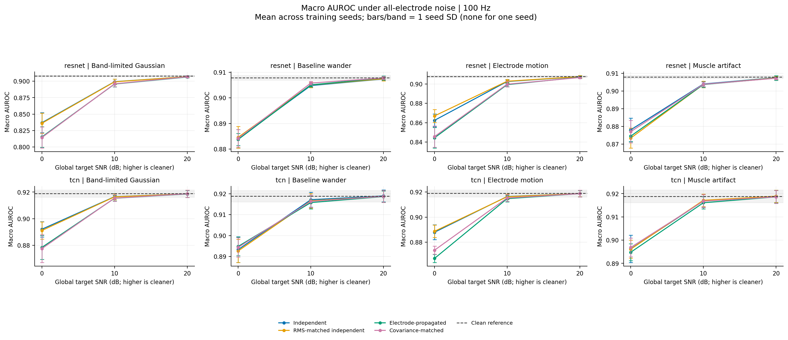

### 7.2 配对主对照：electrode − independent_rms

负ΔAUROC表示映射条件更差；正ΔBCE表示映射条件损失更高。

|模型|SNR|ΔAUROC [训练种子95%CI]|患者ΔBCE [患者bootstrap95%CI]|BCE Holm p|dz|
|---|---:|---|---|---:|---:|
|resnet|20|-0.000527 [-0.001123, 0.000069]|0.000704 [-0.000259, 0.001624]|1.000000|0.0334|
|resnet|10|-0.003382 [-0.006625, -0.000139]|0.009818 [0.007362, 0.012344]|0.007199|0.1749|
|resnet|0|-0.020754 [-0.027512, -0.013996]|0.053581 [0.049060, 0.058125]|0.007199|0.5567|
|tcn|20|-0.000063 [-0.000437, 0.000311]|-0.000552 [-0.001455, 0.000413]|1.000000|-0.0264|
|tcn|10|-0.001071 [-0.001745, -0.000397]|0.001159 [-0.001484, 0.003794]|1.000000|0.0192|
|tcn|0|-0.012690 [-0.022854, -0.002526]|0.099038 [0.092734, 0.105033]|0.007199|0.7543|

0dB两个模型三个训练种子AUROC差均为负，配对种子CI不含零；患者loss经Holm仍支持更高损失。10dB的ResNet同样有患者loss证据；TCN虽然主噪声的种子AUROC CI不含零，患者loss CI却含零，不能混为同一结论。20dB无稳定证据。

患者极端样本诊断如下；按绝对差异大小移除ceil(5%×患者数)，只是描述性敏感性分析，不替换主CI或p。

|模型|SNR|患者ΔBCE中位数|正差比例|去掉绝对差异最大5%后均值|
|---|---:|---:|---:|---:|
|resnet|20|0.000733|54.66%|0.000879|
|resnet|10|0.007855|62.44%|0.008196|
|resnet|0|0.045246|70.48%|0.041912|
|tcn|20|0.000169|57.22%|-0.000093|
|tcn|10|0.003259|64.46%|0.002832|
|tcn|0|0.072494|79.65%|0.085780|

0dB移除最大5%差异患者后，两个模型均保持正的平均损失差；不是由一两个极端患者单独驱动，但仍不是人人一致。

### 7.3 协方差对照

|模型|SNR|covariance − electrode ΔAUROC [训练种子95%CI]|患者ΔBCE Holm p|
|---|---:|---|---:|
|resnet|20|0.000395 [-0.000031, 0.000821]|1.000000|
|resnet|10|0.000334 [-0.000025, 0.000694]|1.000000|
|resnet|0|-0.000910 [-0.003448, 0.001628]|1.000000|
|tcn|20|0.000126 [0.000054, 0.000198]|1.000000|
|tcn|10|0.000103 [-0.000751, 0.000956]|1.000000|
|tcn|0|-0.000906 [-0.005111, 0.003298]|1.000000|

多数AUROC区间包含零，六个患者loss Holm p均为1。TCN20dB有很小的正AUROC差，种子CI不含零；不应隐藏这一例外。**相近不等于证明等价**：没有预注册等价界值/等价检验，且只有三训练种子。结果支持“二阶跨导联结构值得控制”，不支持“电极路径优于统计等效生成路径”的论断。

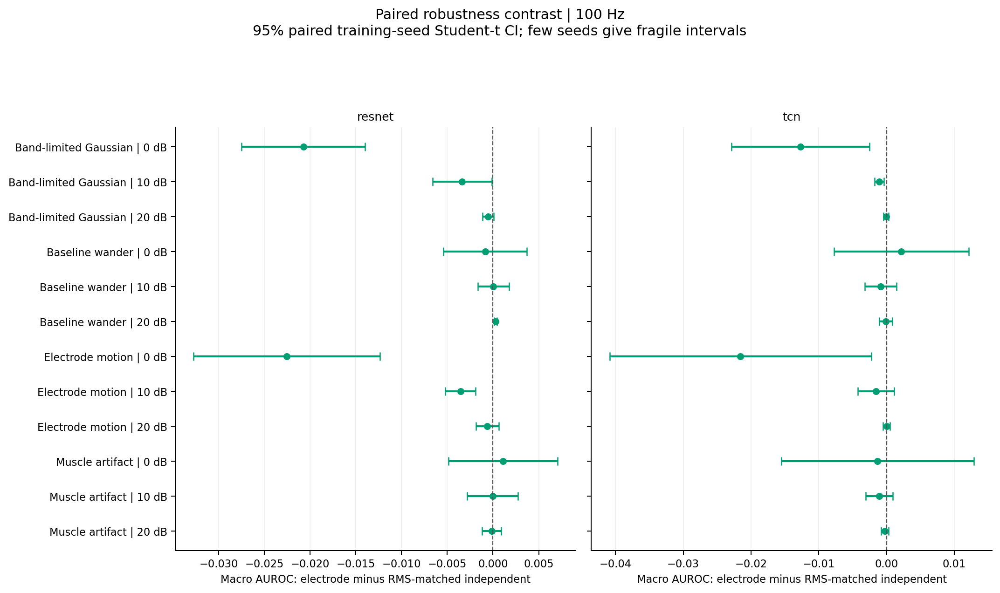

### 7.4 0dB辅助指标与类别

下面为三种子均值；全部SD/CI在metrics_summary.csv，不能把本表无误差条当成无不确定性。

|模型|条件|Macro-AP|Macro-F1|记录平均BCE|Brier|ECE|置信度|与clean二元判定一致率|
|---|---|---:|---:|---:|---:|---:|---:|---:|
|resnet|clean|0.78607|0.71774|0.31422|0.09612|0.04698|0.88780|1.00000|
|resnet|independent|0.67001|0.54872|0.47408|0.15611|0.13531|0.78353|0.77553|
|resnet|independent_rms|0.66803|0.54749|0.47599|0.15683|0.13673|0.78278|0.77377|
|resnet|electrode|0.63826|0.48589|0.52901|0.17735|0.15942|0.78056|0.72555|
|resnet|covariance|0.63626|0.48382|0.53002|0.17777|0.16009|0.78000|0.72360|
|tcn|clean|0.80896|0.74058|0.29930|0.08955|0.04521|0.91028|1.00000|
|tcn|independent|0.76122|0.58325|0.43037|0.13722|0.13515|0.81081|0.77970|
|tcn|independent_rms|0.75944|0.57707|0.43673|0.13928|0.13893|0.80926|0.77312|
|tcn|electrode|0.73881|0.48030|0.53258|0.17070|0.19503|0.78040|0.67754|
|tcn|covariance|0.74014|0.47932|0.53137|0.17052|0.19525|0.78038|0.67770|

映射条件更明显破坏固定阈值F1、Brier/ECE与预测稳定性；阈值未在noisy test重新调优。TCN较高AUROC不保证强噪声下更高F1。

逐类AUROC差（electrode−independent_rms，0dB，均值，描述性）：

|模型|NORM|MI|STTC|CD|HYP|
|---|---:|---:|---:|---:|---:|
|resnet|-0.023613|-0.031813|-0.029190|-0.019866|0.000712|
|tcn|-0.011062|-0.020323|-0.014460|-0.009652|-0.007954|

效应不限于一个类别；ResNet HYP为微小相反方向，不能写成所有类别都恶化。逐类图展示10dB的clean−noisy差，不应与本表0dB的噪声间差直接混读。

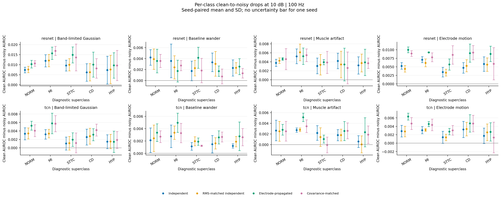

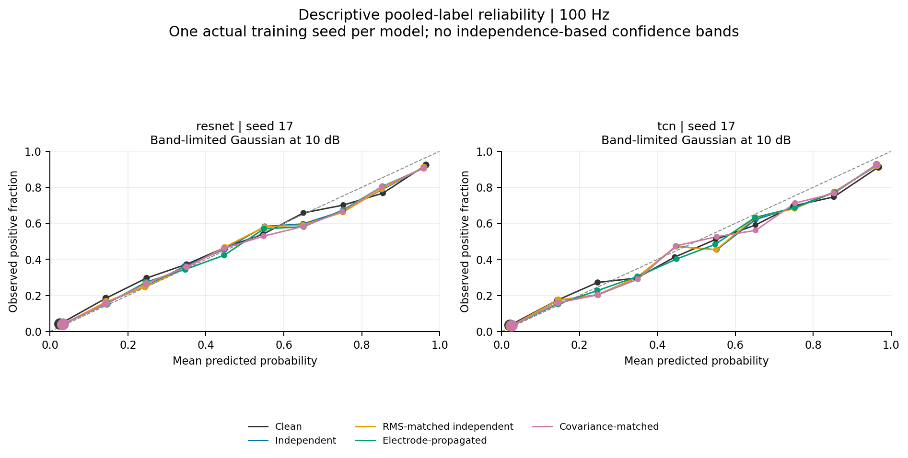

## 8. 五组独立噪声重复与排名稳定性

Full新增360组，均在原六份checkpoint、原2158条测试记录上运行，未触碰测试阈值或重新训练。表中差仍为electrode−independent_rms；范围来自五个noise base内先平均三个训练种子的结果。

|模型|SNR|ΔAUROC跨噪声重复均值±SD|五个噪声平均值范围|负差组合/15|
|---|---:|---|---|---:|
|resnet|20|-0.000155 ± 0.000531|[-0.000911, 0.000481]|8/15|
|resnet|10|-0.002211 ± 0.001099|[-0.003739, -0.000690]|14/15|
|resnet|0|-0.018805 ± 0.000588|[-0.019495, -0.018073]|15/15|
|tcn|20|0.000112 ± 0.000167|[-0.000052, 0.000379]|5/15|
|tcn|10|-0.000522 ± 0.000529|[-0.001141, 0.000046]|10/15|
|tcn|0|-0.012443 ± 0.001265|[-0.013932, -0.010666]|15/15|

**0dB结论最稳健**：两模型5/5噪声平均值为负，且15/15训练×噪声组合为负。ResNet10dB的五个平均值均负，但个别训练×噪声组合正；TCN10dB的噪声平均值范围跨零。20dB两模型都有符号变化。主base8128不是被挑选来追求显著性的唯一依据；也没有把追加重复当作新的患者或独立训练。

当前主评估的所有all-active条件保持Macro-AUROC模型排序（TCN>ResNet）。**Macro-F1出现指标特异的反转**：主base下，0dB RMS独立为TCN0.57707>ResNet0.54749，映射为TCN0.48030<ResNet0.48589。五噪声重复的TCN−ResNet F1差如下：

|0dB条件|noise101|202|303|404|505|
|---|---:|---:|---:|---:|---:|
|independent_rms|+0.033286|+0.028754|+0.031672|+0.034176|+0.028316|
|electrode|-0.006331|+0.000218|-0.004977|-0.003417|-0.003960|
|covariance|-0.002722|-0.007734|-0.006204|-0.005149|+0.001502|

RMS独立5/5保持TCN更高；映射和协方差条件各4/5反转，**不是五次都反转**。仅两架构，且容量/归一化不同，不推断通用模型排行榜变化。主统计中bandpass0dB映射/协方差及em0dB映射的F1相对clean排名Spearman/Kendall为−1，其余all-active排名并非全部反转。

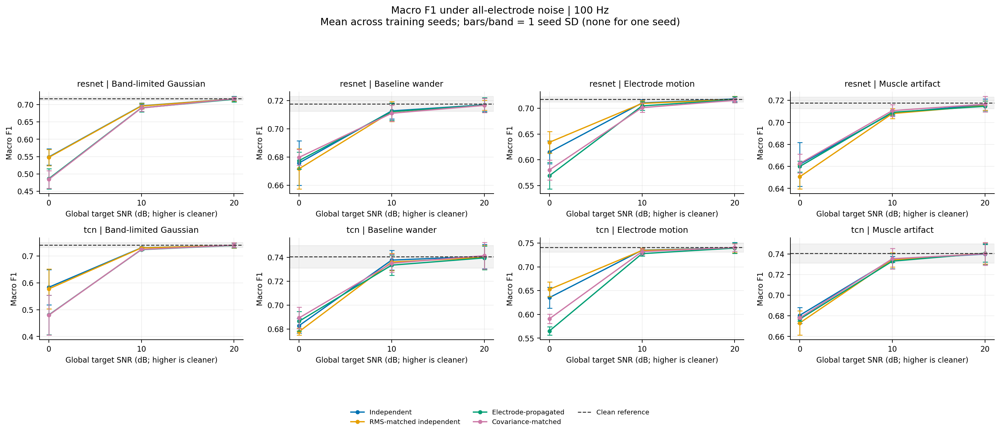

## 9. 混杂敏感性回放与单电极扩展

### 9.1 NSTDB：存在混杂的敏感性回放，不与Gaussian同层解释

AUROC差为electrode−independent_rms，种子均值[95%CI]。

|类型|SNR|ResNet ΔAUROC [训练种子95%CI]|TCN ΔAUROC [训练种子95%CI]|
|---|---:|---|---|
|bw|20|0.000298 [0.000136, 0.000459]|-0.000081 [-0.001044, 0.000882]|
|bw|10|0.000049 [-0.001644, 0.001742]|-0.000850 [-0.003196, 0.001496]|
|bw|0|-0.000857 [-0.005416, 0.003702]|0.002180 [-0.007752, 0.012112]|
|ma|20|-0.000141 [-0.001194, 0.000912]|-0.000281 [-0.000832, 0.000270]|
|ma|10|-0.000045 [-0.002809, 0.002718]|-0.001050 [-0.003050, 0.000950]|
|ma|0|0.001100 [-0.004886, 0.007086]|-0.001331 [-0.015526, 0.012863]|
|em|20|-0.000626 [-0.001886, 0.000634]|-0.000008 [-0.000520, 0.000504]|
|em|10|-0.003569 [-0.005238, -0.001900]|-0.001561 [-0.004256, 0.001134]|
|em|0|-0.022565 [-0.032764, -0.012367]|-0.021564 [-0.040870, -0.002258]|

bw/ma多数差异很小、区间跨零且方向不固定；em0dB两个模型都有负差。**这不是跨所有噪声类型的一致结果，也不与合成Gaussian受控实验处于同一因果证据层级。** RMS匹配虽成立，NSTDB两类条件仍有18%–24%的聚合PSD差及明显短窗口经验相关；高阶幅度/时间结构也未匹配。因此这里只回答“模型对这组复合扰动是否敏感”，不能把em差异纯归因于相关结构，也不能把bw/ma的近零结果当作无物理影响的证明。

### 9.2 九个单电极：10dB

以下为clean Macro-AUROC减受扰Macro-AUROC，三个训练种子平均；斜线依次是映射、RMS独立、协方差对照。完整SD/CI见原表，未做电极间多重比较推断。

|单电极|ResNet下降：映射/RMS独立/协方差|TCN下降：映射/RMS独立/协方差|
|---|---|---|
|RA|0.012277 / 0.009113 / 0.011856|0.003856 / 0.002344 / 0.003694|
|LA|0.011454 / 0.009055 / 0.012082|0.004619 / 0.002687 / 0.004879|
|LL|0.017295 / 0.009875 / 0.015499|0.004514 / 0.002914 / 0.004565|
|V1|0.010779 / 0.010019 / 0.009424|0.001990 / 0.002098 / 0.001539|
|V2|0.008793 / 0.008604 / 0.007447|0.002388 / 0.002235 / 0.001364|
|V3|0.008284 / 0.006963 / 0.006729|0.001771 / 0.001637 / 0.001313|
|V4|0.006784 / 0.006621 / 0.005983|0.001287 / 0.001367 / 0.001323|
|V5|0.008314 / 0.008475 / 0.008387|0.001259 / 0.001902 / 0.001483|
|V6|0.008385 / 0.008435 / 0.008267|0.002159 / 0.001684 / 0.001882|

点估计上ResNet对LL最大（下降0.01730），TCN对LA略高于LL（0.00462/0.00451）；单胸前节点多数较小。但不同电极在相同全局SNR下有不同局部集中程度、噪声原始电势幅度和传播范围，不能据此排临床脱落风险，也不能宣称LL/LA显著优于其它电极。

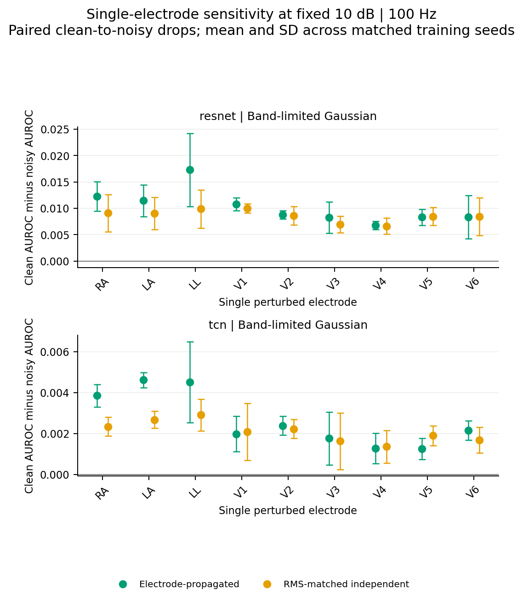

## 10. 失败实验、诊断与修复记录

详细轨迹：`results/logs/failures.json`、`setup.log`、各运行日志及以下证据JSON。失败未被删除或替换成成功叙述。

1. **DGX不可用**：NVIDIA Sync的dgx域名解析失败；历史IPv6 SSH超时。保留尝试记录，转本机CUDA；不是使用了DGX后遗漏日志。
2. **完整数据下载过慢**：顺序HTTP Range开销大；保留已验证缓存后改为6-worker、有界8MiB预取。完成官方100Hz全部记录、CRC/SHA/大小与库存清单检查；不是改用不明镜像或减少主数据范围。
3. **Windows mmap清理失败**：早期临时目录测试仍持有映射句柄。读取器先验证元数据、测试显式释放其拥有的mmap；不是忽略异常掩盖泄漏。
4. **临床噪声未满足隔离门槛**：独立片段经验相关不小、PSD差较大。保留真实回放性质和失败诊断，标记探索性，而非修改门槛声称通过。
5. **结果完整性守卫缺口**：原statistics可接受整组SNR缺失；现要求完成评估协议和完整配置网格。缺失整组的回归复现修复前失败、修复后通过。Evaluate增加已完成checkpoint与当前数据身份/模型/seed一致性检查；真实CLI拒绝证据见 `integrity_guard_smoke.json`。
6. **训练/独立评估数值策略不一致**：训练/验证禁用TF32，但早期独立评估继承默认cuDNN TF32。256条pilot探针最大概率差0.001404、1个阈值判定变化。现evaluate/replay复用训练执行策略，并保存四项实际torch标志。Smoke、pilot及pilot噪声重放全部重算；full从首次主评估起即使用修正策略。
7. **精度修正保留证据**：修正前255个文件（235份预测及相关表/报告/源码）归档 `results/logs/precision_before_fix.zip`，SHA256 `6fe6959e2f3c0ca9b817f30731fce11bddc9c019e2f8b3910757fc25bc68bea5`。前后标签、ID、阈值、索引、实际噪声强度与种子逐数组完全相同。Smoke概率最大差0.000782、1/8000二元判定变化；pilot0.002427、38/195000；pilot重放0.002896、156/900000。当前报告只用重算结果，详见 `precision_correction.json`。
8. **模型过拟合与效应不一致**：ResNet后期训练loss继续下降但验证退化；保存/采用验证最佳权重。Pilot的三SNR AUROC配对CI均跨零；full的强噪声结果更明确，但数据/时长/队列同时改变，不能用结果反过来掩盖pilot的负面证据。没有为了制造所有条件显著而加模型或挑种子。

## 11. 复现命令、文件与独立验收

### 11.1 从新环境开始

从项目根目录执行，先安装与机器适配的PyTorch CUDA wheel。以下准备命令仅用于首次下载/预处理；现有已训练缓存应直接复用。

```sh
python -m venv .venv
# 激活项目虚拟环境后：
python -m pip install -r requirements.txt
python -m src.environment
python -m src.download_ptbxl --nstdb --nstdb-dir data/raw/nstdb --workers 6
python -m src.prepare_ptbxl --require-all
python -m src.prepare_ptbxl --limit 1000 --require-all --output-dir data/processed_smoke --results-dir results/smoke_preparation
python -m src.prepare_ptbxl --limit 10000 --require-all --output-dir data/processed_pilot --results-dir results/pilot_preparation
bash scripts/run_smoke_test.sh
bash scripts/run_pilot.sh
bash scripts/run_full_phase1.sh
```

Windows无Bash时使用等价入口；本机实际python为 `E:/Eproject/ECG/phase1_ecg_robustness/.venv/Scripts/python.exe`：

```sh
python -u -m src.run_experiment --config configs/phase1_smoke.yaml
python -u -m src.run_experiment --config configs/phase1_pilot.yaml
python -u -m src.run_experiment --config configs/phase1_full.yaml
python -u scripts/replay_noise.py --config configs/phase1_pilot.yaml --noise-seeds 101 202 303 404 505
python -u scripts/replay_noise.py --config configs/phase1_full.yaml --noise-seeds 101 202 303 404 505
```

已有缓存上的单阶段复核/重绘：

```sh
python -m pytest tests -q --junitxml=results/logs/tests.xml
python -m src.train --config configs/phase1_full.yaml --resume-completed
python -m src.evaluate --config configs/phase1_full.yaml
python -m src.statistics --config configs/phase1_full.yaml
python -m src.plotting --config configs/phase1_full.yaml --pdf
```

`--resume-completed`只跳过配置、数据身份和划分相同的已完成训练。中断训练保留last/best，但再次运行从该种子epoch1开始，不声称逐步断点续训。移动/重做缓存会改变含路径/时间/清单的数据身份；这时须新run_name训练，不能强行加载旧checkpoint。重算统计或图无需重新prepare；重跑evaluate会重新计算完整配置。不是每条复现命令都应不分场景连续执行。

### 11.2 交付物索引

|内容|项目内路径|
|---|---|
|总入口/依赖|README.md；requirements.txt；requirements-lock.txt|
|四配置|configs/phase1_smoke.yaml、phase1_pilot.yaml、phase1_full.yaml、phase1_noise_diagnostic.yaml|
|用户要求的源码|src/download_ptbxl.py、prepare_ptbxl.py、lead_matrix.py、noise_generators.py、covariance_matching.py、datasets.py、models.py、train.py、evaluate.py、statistics.py、plotting.py|
|辅助入口|src/audit_noise.py、environment.py、run_experiment.py；scripts/run_*.sh；scripts/replay_noise.py|
|数据/许可/处理清单|data/README.md；data/download_manifest.json；data/processed/preparation.json|
|全部真实模型指标|results/metrics/{smoke,pilot,full}/metrics.csv|
|每记录预测/强度|results/metrics/{run}/{model}/seed_{seed}/*.npz|
|完成状态/配置指纹|evaluation_protocol.json；results/logs/{run}/run_status.json|
|均值、SD、CI、配对和排名|results/tables/{run}/metrics_summary.csv、paired_effects.csv、seed_contrasts.csv、rank*.csv、statistics_protocol.json|
|五噪声重复|results/metrics/{pilot,full}_noise_repeats/；results/tables/{pilot,full}_noise_repeats/|
|best/last权重|results/checkpoints/{run}/{model}/seed_{seed}.pt、seed_{seed}.last.pt|
|每epoch训练轨迹|results/logs/{run}/{model}/seed_{seed}/|
|全部图和来源说明|results/figures/full/figure_manifest.json（11张PNG/10图族）|
|失败与修正|results/logs/failures.json、precision_correction.json、precision_before_fix.zip|
|最终全量独立审计|results/logs/final_verification.json|
|中期报告|reports/phase1_interim_report.md（已用修正后数值重写）|

README中的目录参数与配置一致；数据和大checkpoint不放Git，原始数据许可与引用不能省略。环境锁包含本机继承包，仅作实际环境证据；跨设备安装优先使用requirements.txt和适配CUDA的Torch，而非机械复制所有继承包。

### 11.3 当前结果的独立验收证据

`final_verification.json`状态passed：

- 独立加载**全部1051份NPZ**，重算主指标；最大差2.22e−16。
- 检查所有条件的记录索引、ECG/患者ID、标签、阈值，以及跨模型/训练种子的同噪声配对；全部一致。
- 从真实缓存信号功率与保存RMS复算实际SNR，检查12导联RMS匹配、单电极零噪声支持集；全部通过。
- 对10份checkpoint计算SHA256、确认完成epoch数与患者不泄漏；未把best epoch较早误判为训练未完成。
- 对full两模型seed17各重算32条clean预测，最大差1.19e−7；独立重建每模型四种噪声各一条输入，最大概率差2.98e−8。额外smoke100条clean重算差为零。这里的“小批次重放”不伪称重新跑了全部训练/全体输入重建。
- 11张full PNG逐一视觉检查，曲线/标签/色标可读，无裁切。图6误差是种子SD、图8是配对种子CI、校准图是seed17示意，均在图注中明确。
- 收尾完整回归套件：**19 passed、15 subtests passed**。README中的 `train --resume-completed` 实际校验并跳过全部六个full训练；`plotting --pdf` 实际成功，另生成11份PDF版本。环境采集命令再次执行，CUDA反向传播探针passed，当前依赖锁已刷新。最后直接执行 `scripts/run_smoke_test.sh`，五阶段再次exit0（复用已完成训练，重算16组评估/统计/图）；完整输出在 `results/logs/readme_smoke_reproduction.log`。

测试与运行日志在 `results/logs/tests.xml`、各run日志及 `integrity_guard_smoke.json`。数学/数据/错误边界测试用于真实契约；并未用仅检查源码字符串或“函数不报错”的测试冒充实验有效性。

## 12. 逐项回答七个最终研究问题

1. **A是否符合标准导联关系，传播是否可解释？** 是。−1/3符号按WCT修正；rank8、共模抵消、四个肢体关系与单位传播均验证。它是新增结构噪声模型，不是真实电极恢复或完整设备电路。
2. **独立、电极、协方差噪声的统计是否按设计不同/相近？** 是，但要分清估计量。Float64验证诊断协方差误差约1.36e−15；实际注入float32后Gaussian三SNR均值约4.54e−9至6.39e−9。原2%–3%PSD差属于跨记录平均谱，不代表逐记录匹配；实际逐记录平均Welch L1约20.95%，单导联观测最大64.17%。完整协方差、相关、方差、SNR和频带误差见§14.3；NSTDB不满足纯结构隔离。
3. **同/近SNR、PSD、逐导联RMS下性能是否不同？** 合成0dB是。RMS控制以及新增经验边际/周期谱匹配控制均保留负AUROC差，患者区间也不含零。但普通Welch谱仍有残差，移位改变的是跨导联相位/时滞关系，不能宣称已隔离唯一的零时滞协方差机制或证明生成路径效应。
4. **方向是否跨种子、SNR、类型一致？** 不全面一致。0dB主3种子及额外5噪声重复方向稳定；20dB接近零、10dB尤其TCN实现敏感；bw/ma/em不同。Pilot AUROC CI也未给出同等确定证据。
5. **哪些电极/导联受影响最多？** 传播上肢体节点影响11导联，单胸节点影响一个。10dB模型点估计ResNet为LL最大，TCN为LA/LL较大；未做电极间确证性比较，且等全局能量不等原始电极幅度，不能排临床风险。
6. **是否足够支持“独立导联噪声可能造成鲁棒性评价偏差”？** 足以支持这个有范围限定的“可能”：当前强合成结构噪声下，独立导联方法更乐观，且F1构型排名可改变。不足以支持所有任务、SNR、设备和临床人群的一般定律；无外部/设备真实分布验证。
7. **第二阶段需要什么验证？** 见下一节：更多独立训练、联合不确定性、500Hz/外部数据、容量/归一化控制与真实硬件机制，并预注册匹配的鲁棒训练对照。当前结果是进入这些验证的依据，而不是替代它们。

## 13. 负结果、剩余限制与第二阶段建议

**必须保留的负结果**：pilot各SNR AUROC CI跨零；20dB近零/变号；TCN10dB新增噪声平均值可为正；bw/ma并不一致；ResNet HYP不随其它类同向；协方差“近似”不是等价；F1反转不是五重复全发生；DGX/500Hz/外部/硬件实验未执行。原始标签噪声、clean既有伪差和100Hz频带限制仍在。

第二阶段建议按预注册方案执行，而不是继续挑能产生显著性的条件：

1. 扩充独立训练种子（至少5作为起点，正式数量依据效应精度/功效设计），以患者×训练×噪声交叉/分层方式估计联合不确定性；保留固定测试队列和独立验证。
2. 做500Hz、外部数据集/设备与诊断标签对齐验证；增加原始信号质量、类别、患者/采集亚组分析，避免只在同一测试队列重复生成更多噪声当成泛化证据。
3. 匹配或消融参数量、BatchNorm/GroupNorm、正则化，增加有代表性的模型，而非由当前两个不同容量构型推出一般架构优劣。
4. 循环移位方法保留经验边际与周期谱，但不消除跨导联时滞依赖；后续需预注册非周期短窗、高阶联合结构和有限窗口Welch的敏感性检验，并为covariance与electrode定义有实际意义的等价界值。真实噪声无法隔离时明示复合机制。
5. 验证采集硬件机制：参考/右腿驱动动态、电极接触阻抗、饱和、断连/重连、放大器与滤波差异；不能把线性A下零RL列当成这些机制已覆盖。
6. 鲁棒训练主比较固定为四种策略：**clean-only、independent-noise、electrode-noise、mixed**。Independent优先使用逐导联RMS匹配版本；mixed为独立与电极扰动的预注册混合，不在看过测试结果后改比例。四策略统一训练步数/样本曝光、种子、模型容量、优化器和验证选择规则，同时报告clean代价；covariance可作为另列机制消融，不替代mixed主组。
7. 训练使用预先规定的扰动分布，测试加入**未见15/5dB**、未见电极组合及噪声类型组合；训练和测试的噪声基础种子隔离，记录/患者不跨分区。保持clean验证阈值，不能在noisy test调参掩盖校准退化。**本次没有执行这些第二阶段训练或未见条件评估。**
   四种训练策略使用同一测试矩阵：clean、independent（含RMS匹配控制）、electrode、covariance-matched；核心指标为Macro-AUROC、Macro-F1、clean下降量和患者级bootstrap CI。核心问题是未见噪声强度/电极组合的泛化，不是适应训练时相同扰动。

**最终判断**：第一阶段端到端实验已完成，并给出了强合成噪声下可重复的条件性证据、低强度/临床回放的负面与混杂证据，以及完整可审计产物；没有把阶段一结果升级为未经验证的临床结论。

## 14. 审阅补充：统计口径与更严格控制

### 14.1 矩阵版本和数据来源核验

没有发现当前有效结果使用错误的+1/3矩阵。`matrix_replay_protocol.json`记录：smoke12、pilot27、full378、pilot_noise_repeats135、full_noise_repeats270，共**822份矩阵依赖预测**，全部按原seed、0dB生成→float32缓存→float32缩放→float32加噪、原批大小及确定性FP32重建并前向重放；**概率最大绝对差0**，全部标签/ID/患者/索引/阈值/强度/种子精确相同。另229份clean/原始independent不依赖A，明确不在这项前向重放范围内；不将其计为822项中的验证。

当前规范矩阵哈希为 `4f852acd9c5a4f7b35a207f5078d70f842de3077d648716950a66502951bfe9d`，计算对象是schema、两种坐标顺序与全部数值的规范JSON；固定于补充配置。旧噪声示例缓存内A已核验，并重建其噪声/协方差/相关数组；原ECG缓存不依赖该噪声生成矩阵，其原数据身份和元数据/标签哈希保留。中期与本报告均使用负WCT系数。

三次主运行的矩阵PNG均为SHA256 `d2f35f0c7a8b278bcd7875afc49186df57f78802f47aed504b413e25ef21d692`；单位传播PNG均为 `7c01126fe8b21b56e2c6b066a6d248df8d639f3e668d64e50eaaf5dda744f990`。图像目视核验显示V1–V6的RA/LA/LL系数均为−0.33；不是只核查源码而忽略交付图。

**来源边界**：旧配置/预测/图表没有生成时矩阵哈希；这些是源码、缓存、文件哈希和全量重放的追溯证据，不是追补生成时签名。新严格对照在生成时保存矩阵哈希。`precision_before_fix.zip`仍为单独历史精度归档，不混入当前推断。逐文件明细、配置/checkpoint/图表来源和归档索引见 `results/tables/review_supplement/matrix_replay_files.csv`、`matrix_artifact_evidence.json`；数据排除与采样审计见§2、§4.2。

### 14.2 A：患者级AUROC配对bootstrap

固定full六份checkpoint、clean验证阈值和base8128逐记录噪声，不重新训练、调阈值或生成噪声。按patient_id均匀有放回抽1877次，共2000个replicate，seed **20260917**、NumPy PCG64。每个被抽患者的全部ECG保留并带入抽中次数；每次重算**记录级**AUROC。患者为抽样簇，不是先平均其概率再计算“患者AUROC”。每份模型独立算AUROC，再对三个固定训练种子取算术平均；不是概率ensemble。

同一患者multiplicity用于全部类别、模型、条件、SNR及配对两端。Macro固定为五类AUROC均值，不因某类缺失而缩减类别；未定义抽样应保留NaN并计数，不重抽。本次所有6240个区间均有2000个有效replicate、无未定义点或区间。保存单训练种子及固定三种子均值，包含clean、四种原噪声的all-active三SNR和Gaussian移位对照；原单电极文件经对齐/哈希验证，但不新增其AUROC bootstrap。

以下均为**固定三种子均值的配对ΔAUROC [患者簇百分位95%CI]**，不是训练种子t区间。三类不确定性没有合并；区间是逐项描述性区间，未新增多重比较显著性星号或等价性判决。

|模型|SNR|electrode−independent_rms|electrode−marginal_shift|covariance−electrode|
|---|---:|---|---|---|
|resnet|20|-0.000527 [-0.001063, 0.000009]|-0.000174 [-0.000704, 0.000345]|0.000395 [-0.000161, 0.000976]|
|resnet|10|-0.003382 [-0.004905, -0.001847]|-0.002404 [-0.003898, -0.000919]|0.000334 [-0.001275, 0.001942]|
|resnet|0|-0.020754 [-0.024722, -0.016598]|-0.018038 [-0.022322, -0.013825]|-0.000910 [-0.005537, 0.003576]|
|tcn|20|-0.000063 [-0.000462, 0.000343]|-0.000066 [-0.000455, 0.000315]|0.000126 [-0.000269, 0.000545]|
|tcn|10|-0.001071 [-0.002183, 0.000097]|-0.000858 [-0.001987, 0.000268]|0.000103 [-0.000999, 0.001253]|
|tcn|0|-0.012690 [-0.015598, -0.009634]|-0.013503 [-0.016362, -0.010367]|-0.000906 [-0.003752, 0.001957]|

因此：0dB两模型的两种主要控制差均为负；20dB均包含零。ResNet10dB两种区间为负，但**TCN10dB两种区间均包含零**，不能因其旧训练种子区间不跨零而省略患者不确定性。Covariance−electrode六个Macro区间均包含零，但没有预注册等价界值，不能解释为已证明等价。

0dB逐类结果如下；**20/10dB逐类结果同样保留在下图和CSV**，不是只计算有利的0dB。

|模型|类别|electrode−independent_rms [患者95%CI]|electrode−marginal_shift [患者95%CI]|
|---|---|---|---|
|resnet|NORM|-0.023613 [-0.03052, -0.01676]|-0.019291 [-0.02599, -0.01161]|
|resnet|MI|-0.031813 [-0.04216, -0.02133]|-0.030284 [-0.04065, -0.02032]|
|resnet|STTC|-0.029190 [-0.03821, -0.02008]|-0.026202 [-0.03522, -0.01668]|
|resnet|CD|-0.019866 [-0.02937, -0.01053]|-0.014779 [-0.02325, -0.00609]|
|resnet|HYP|0.000712 [-0.00678, 0.00796]|0.000366 [-0.00654, 0.00722]|
|tcn|NORM|-0.011062 [-0.01513, -0.00723]|-0.011437 [-0.01543, -0.00765]|
|tcn|MI|-0.020323 [-0.02876, -0.01196]|-0.020680 [-0.02911, -0.01208]|
|tcn|STTC|-0.014460 [-0.01948, -0.00966]|-0.016869 [-0.02184, -0.01216]|
|tcn|CD|-0.009652 [-0.01628, -0.00293]|-0.011767 [-0.01836, -0.00523]|
|tcn|HYP|-0.007954 [-0.01319, -0.00279]|-0.006763 [-0.01228, -0.00134]|

ResNet HYP仍是方向/精度边界，不改写成所有类别一致。NSTDB也计算了相同患者区间，但**患者重采样不会消除频谱/时序混杂**；其三组图明确标注confounded sensitivity，不能据区间是否跨零提升到Gaussian的因果证据层级。

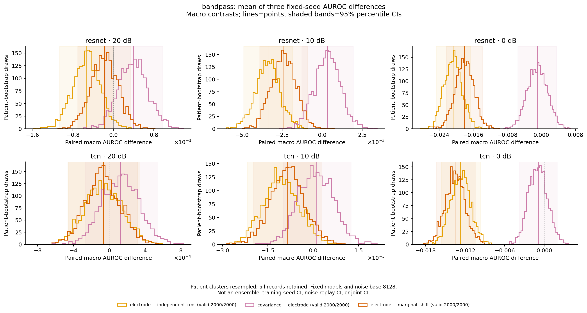

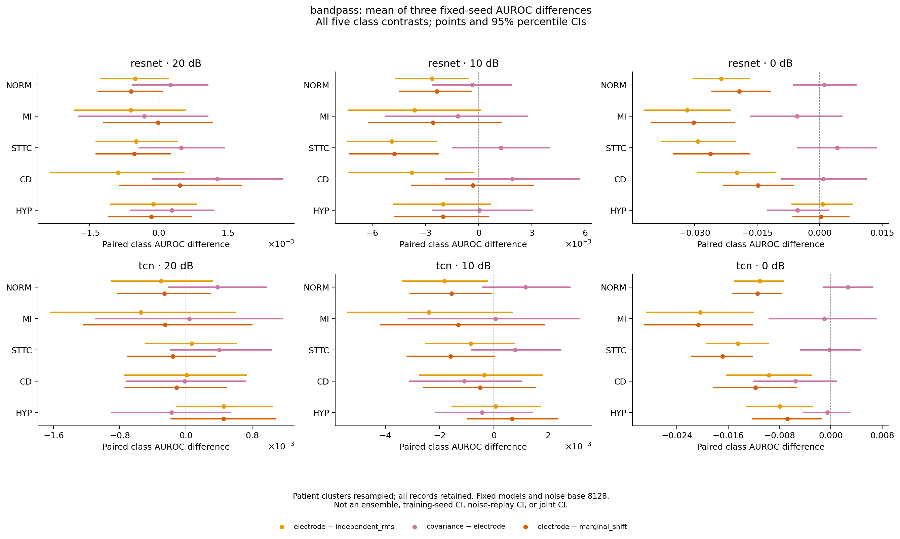

原始抽样计数/患者顺序/记录映射在 `patient_bootstrap_draws.npz`；完整2000×6240分布及索引在 `patient_bootstrap_distributions.npz`；对应区间、无效次数及条件声明在 `patient_bootstrap_auroc_ci.csv`。三者位于 `results/tables/review_supplement/`。协议另记录2000次、seed20260917、batch128、924份输入预测校验和；原训练种子t区间及五次噪声SD分别另表保存，不互相替代。

### 14.3 B：实际注入数组的协方差匹配程度

本次审计**全部2158条测试ECG×四种噪声×三SNR，共25896个记录条件**，使用实际注入的float32噪声，再以float64累计协方差/功率；不是只报告理想float64生成器。表中为Gaussian各SNR的**记录均值±样本SD（观测最大值）**：

|指标：covariance相对electrode|20dB|10dB|0dB|
|---|---|---|---|
|协方差Frobenius相对误差|6.365e-09 ± 8.88e-10 (1.031e-08)|6.391e-09 ± 8.69e-10 (9.870e-09)|4.544e-09 ± 6.15e-10 (7.000e-09)|
|相关矩阵MAE|1.534e-09 ± 1.79e-10 (2.181e-09)|1.540e-09 ± 1.84e-10 (2.103e-09)|1.093e-09 ± 1.28e-10 (1.567e-09)|
|逐记录最大导联方差相对误差|1.073e-08 ± 2.73e-09 (2.307e-08)|1.070e-08 ± 2.74e-09 (2.532e-08)|7.648e-09 ± 1.92e-09 (1.587e-08)|
|实际SNR绝对差，dB|5.671e-09 ± 4.23e-09 (2.849e-08)|5.684e-09 ± 4.27e-09 (2.877e-08)|4.122e-09 ± 3.06e-09 (2.206e-08)|
|逐记录12导联平均Welch谱相对L1|2.095e-01 ± 1.86e-02 (2.780e-01)|2.095e-01 ± 1.86e-02 (2.780e-01)|2.095e-01 ± 1.86e-02 (2.780e-01)|
|0.5–40Hz带功率绝对差/参考总Welch功率|1.559e-02 ± 1.16e-02 (6.545e-02)|1.559e-02 ± 1.16e-02 (6.545e-02)|1.559e-02 ± 1.16e-02 (6.545e-02)|

定义：协方差ddof0并去均值；Frobenius分母为electrode协方差范数；相关MAE对全部有效矩阵单元（含对角）平均；方差误差先逐lead取相对值再取每record最大；SNR差是两种噪声的实际SNR之差，不是各自相对目标的误差。Welch为100Hz、Hann256、overlap128、窗口内去常数、单边density。谱L1先在同record内平均12导联谱，再积分绝对差除参考积分；带功率使用端点插值积分。

**协方差精确匹配不等于PSD精确匹配。** 上述Gaussian的逐记录聚合谱L1均值约**20.95%**，单导联观测最大**64.17%**。§4的2%–3%是128条验证记录先跨记录/导联平均谱后的诊断；估计顺序、队列均不同，不能拿总体平均谱接近替代逐记录误差。0dB NSTDB逐记录聚合谱L1均值bw/ma/em为31.26%/42.67%/39.78%，继续按混杂敏感性解释。

`covariance_matching_records.csv`保存每条记录、每lead及聚合谱的总功率、各频带参考功率、绝对误差、按参考带功率/总功率两种归一化；`covariance_matching_summary.csv`保存四类×三SNR的均值/SD/最大值及定义/未定义数量，协议在同目录JSON。极小带功率分母没有epsilon裁切，大相对误差没有删除；本次未定义计数为0。以上均位于 `results/tables/review_supplement/`。

### 14.4 E：严格经验边际/周期谱控制及其边界

新增 `marginal_shift`：对**同一份**electrode-mapped Gaussian噪声，每lead独立均匀抽取0…999的循环位移（允许相同/零位移），不插值、不再归一化；在0dB产生后以原float32乘数缩放。Shift seed **20260918**，`SeedSequence([shift_seed, noise_base, ecg_id])`先派生一个uint32，再作为PCG64的seed抽取偏移；偏移保存在每份NPZ中，跨模型/训练种子/SNR一致。噪声base为8128、101、202、303、404、505。

共新增**2模型×3训练种子×6噪声base×3SNR=108组**预测。2158×6×3=38844行噪声审计不是38844个独立受试者。对实际注入数组的全范围结果：

|匹配项|全审计范围的最大误差/结果|
|---|---:|
|逐lead经验幅度多重集|38844/38844逐元素排序数组完全相等|
|逐lead方差相对差|2.068e−15|
|逐lead RMS相对差|4.369e−16|
|两条件全局SNR绝对差|3.553e−15 dB|
|Strict实际SNR相对目标最大误差|1.6684e−7 dB|
|全记录periodogram逐lead相对L1|4.099e−16|
|0–0.5Hz周期带功率差/参考总功率|8.129e−18|
|0.5–5Hz周期带功率差/参考总功率|1.464e−16|
|5–15Hz周期带功率差/参考总功率|2.605e−16|
|15–40Hz周期带功率差/参考总功率|6.858e−16|
|40–50Hz周期带功率差/参考总功率|8.450e−18|
|普通Welch逐lead相对L1最大值|0.4130（41.30%）|

“严格”限定为**单导联经验边际和全记录周期谱**。周期谱用10秒boxcar、无detrend、density；移位保持其数学不变量，表中非零值为float64诊断舍入。普通Hann分窗Welch并不具备该不变量：base8128/0dB的每记录最大lead Welch L1均值30.89%、SD1.95个百分点，全部base/SNR观测最大41.30%；带功率的Welch残差也全部保存，未藏入周期谱表。

对应base8128/0dB，非对角绝对相关均值从**0.197724降至0.028638**。但移位保留共享源的时滞依赖并改变跨导联相位，不产生联合独立导联噪声，也不证明只改变零时滞协方差。因此对完整联合/短窗统计仍应称**近似公平控制**，而不是“完全匹配一切边际、仅协方差不同”的因果隔离。未把同一方法强行用于非周期NSTDB片段并宣称更真实。

除§14.2的主噪声患者CI，以下是electrode−marginal_shift在五次**额外**noise replay中的描述性稳定性。先平均三训练种子，再对五个base计算均值/样本SD及范围，不给伪造的联合CI。

|模型|SNR|五次均值±SD|五次均值范围|负方向noise均值|负方向训练×noise组合|
|---|---:|---|---|---:|---:|
|resnet|20|-0.000256 ± 0.000260|[-0.000548, 0.000085]|4/5|11/15|
|resnet|10|-0.002463 ± 0.000684|[-0.003333, -0.001426]|5/5|14/15|
|resnet|0|-0.018470 ± 0.001334|[-0.020056, -0.016835]|5/5|15/15|
|tcn|20|0.000098 ± 0.000158|[-0.000077, 0.000331]|1/5|5/15|
|tcn|10|-0.000582 ± 0.000541|[-0.001324, 0.000117]|4/5|14/15|
|tcn|0|-0.012496 ± 0.001131|[-0.014482, -0.011859]|5/5|15/15|

0dB方向稳定，但20dB及TCN10dB仍有反向/跨零结果，不能筛掉。该表由同(model,seed,noise_seed,snr)配对的 `full_noise_repeats/metrics.csv` 与 `review_supplement/strict_metrics.csv` 直接相减；种子均值/SD的定义与原noise replay相同。主8128与五次额外重放分开，不把一次有利实现当成普遍结论。

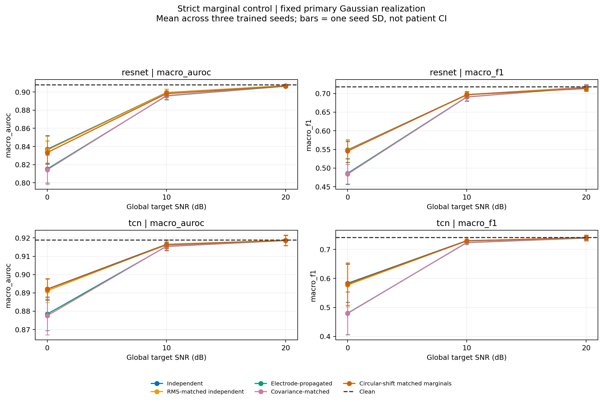

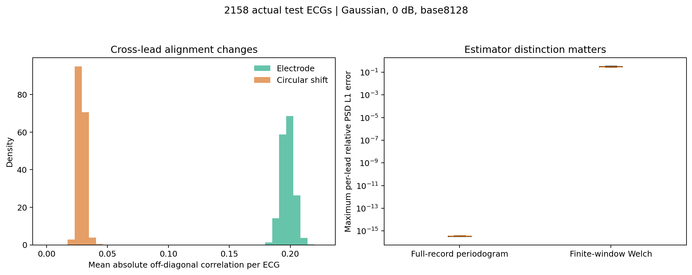

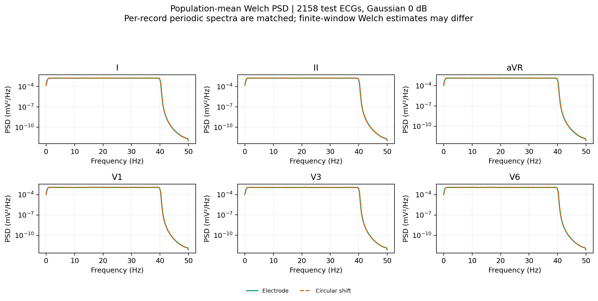

明细在 `strict_marginal_audit.csv`、`strict_marginal_summary.csv`、`strict_welch_psd.csv`；每条预测、offset、实际强度和生成时矩阵哈希在 `results/metrics/review_supplement/strict/`，完整生成协议在其上级 `strict_protocol.json`。

### 14.5 C/D及逐项交付对应

|审阅项|本次完成证据|仍需保留的限制|
|---|---|---|
|A：患者AUROC推断|§14.2；6240行CI、全部抽样计数/分布、逐类和分布图|条件于固定训练模型/主噪声；不是联合区间|
|B：协方差匹配程度|§14.3；25896条实际注入数组诊断|协方差接近不等于时序/PSD/高阶联合分布相同|
|C：全SNR结果|§7.1同时展示20/10/0dB绝对值、下降、训练SD/tCI、noise SD、患者CI；CSV保留所有类型和逐类指标|NSTDB没有五次噪声重放，不补造其SD|
|D：NSTDB降级|§9明确混杂敏感性；三类患者图也单独标注|患者CI不能消除频谱/相关/高阶混杂|
|E：严格边际对照|§14.4；108组新预测、38844行噪声审计和五重复方向|经验边际/周期谱严格匹配；Welch/跨lead时滞联合结构仍非完全隔离|
|数据口径|§2；21799行逐记录清单、411项空诊断排除、其它排除0|分析队列不是未经筛选的官方原始全集|
|采样率|§4.2；实际SciPy FIR/抗混叠/对齐参数及源码哈希|100Hz；500Hz未做|
|矩阵版本|§14.1；822份旧预测全量重放一致、新矩阵指纹和历史归档隔离|旧产物仅可追溯验证，不伪造生成时哈希|
|第二阶段建议|§13：clean/independent/electrode/mixed四策略、未见15/5dB和电极组合|仅建议，本次未启动训练|

复现入口（项目根目录、复用当前缓存和checkpoint）：

```sh
python -u -m src.run_supplement --config configs/phase1_supplement.yaml
# 有Bash时的等价入口，PYTHON可指定项目虚拟环境：
bash scripts/run_review_supplement.sh
# 独立运行各阶段：
python -u -m src.supplemental_audit --config configs/phase1_supplement.yaml
python -u -m src.strict_control --config configs/phase1_supplement.yaml
python -u -m src.supplemental_statistics --config configs/phase1_supplement.yaml
```

三阶段实际exit0，日志/耗时见 `results/logs/review_supplement/run_status.json`。回归验证为**27 tests + 15 subtests通过**（`tests_final.xml`）。新增FFT测试曾因NumPy2对float32 FFT维持单精度而不满足双精度容差；改为与运行审计一致的float64谱累计后通过，没有放宽容差或改动实际注入数组。初始失败与最终记录分开保留。

独立数值复核见 `verification_numerics.json`：1051份既有预测哈希未变；108份严格预测、全部offset配对与强度验证通过；患者抽样计数可按记录的PCG64种子精确再现；全部6240个区间端点重算最大差1.11e−16；用sklearn对replicate0/997/1999、两模型/三SNR/三比较/五类及Macro作324个独立数值检查，最大差1.85e−16。图表曾修复刻度/图例遮挡并由**已保存分布重绘**，未重新计算bootstrap，所有数值产物校验和不变，见 `figure_rerender.json`。

NSTDB仅作混杂敏感性；以下链接均包含20/10/0dB，不提升因果解释等级：

|类型|Macro配对分布|逐类配对区间|
|---|---|---|
|bw|[分布图](../results/figures/review_supplement/patient_bootstrap_distributions_bw.png)|[五类区间](../results/figures/review_supplement/patient_bootstrap_classwise_paired_ci_bw.png)|
|ma|[分布图](../results/figures/review_supplement/patient_bootstrap_distributions_ma.png)|[五类区间](../results/figures/review_supplement/patient_bootstrap_classwise_paired_ci_ma.png)|
|em|[分布图](../results/figures/review_supplement/patient_bootstrap_distributions_em.png)|[五类区间](../results/figures/review_supplement/patient_bootstrap_classwise_paired_ci_em.png)|

全部11张新增PNG已逐一目视核对，PDF同名配套；清单及来源见补充图目录和其 `strict/` 子目录的 `figure_manifest.json`。Bash入口实际执行 `--help` exit0；完整三阶段执行证据仍以上述Python编排日志为准。交付清单、图表/来源文件哈希、报告链接与表格数值核验记录：`results/logs/review_supplement/delivery_verification.json`。本次未创建临时脚本文件，也未删除初始失败证据或改写历史精度归档。
