# 第二阶段实测报告：四种训练策略对未见采集扰动的泛化

生成时间：2026-09-18T19:54:59.781134+00:00。本报告只使用已完成并独立核验的 full 结果；pilot 单列为技术验证，不用于调参。

## 1. 七项判断

| 问题 | 基于实测数据的回答 |
| --- | --- |
| 未见强度 | electrode 相对 independent-RMS 的绝对 AUROC 均值在 3/4 个模型×SNR 单元为正；2/4 个单元五个训练 seed 全部同向。属于分解后的次要描述性证据，见表中原始差值。 |
| 未见组合 | electrode 相对 independent-RMS 的绝对 AUROC 均值在 2/4 个模型×SNR 单元为正；1/4 个单元五个训练 seed 全部同向。属于分解后的次要描述性证据，见表中原始差值。 |
| 跨模型、跨训练 seed | 联合未见主终点中，electrode−independent-RMS 的 retention 差有 10/10 个模型×seed 为正；两模型中 1/2 项获得正向 Holm 校正支持，2/2 项的条件患者区间完全高于 0。两类区间不是联合区间。 |
| clean 代价是否可接受 | 不能用本实验自动裁决临床可接受性：没有预设效用/非劣界值。下表同时报告 clean 指标及同 seed clean-only 减策略的代价；正值代表损失，负值代表改善。retention 必须连同绝对 noisy AUROC 和 clean 代价解读。 |
| NSTDB 是否同向 | 在 electrode 结构、非 0 dB 的 NSTDB 敏感性单元中，electrode−independent-RMS 绝对 AUROC 差为正的有 6/12；完整按模型、噪声类型和强度拆分，不能将源域混杂结果升级为真实采集机制的因果结论。 |
| 是否依赖模型 | 本次两架构的 electrode−independent-RMS 主终点点估计方向同向；resnet: Δretention=0.001372，正向 seed=5/5；tcn: Δretention=0.001138，正向 seed=5/5。这些是固定架构的观察，不把“一个显著、一个不显著”当作显著的模型间差异。未预注册模型×策略交互检验，也没有覆盖其他架构、训练预算或数据集。 |
| 评价协议还是普适训练优势 | 不足以把机制一致增强表述为跨模型普适训练优势；主要结论应限于该评估协议与具体条件下的实测比较，不能择优展示个别模型或 seed。 |

## 2. 冻结设计与执行完整性

科学配置 SHA-256：`980993c490b41e9793164c1d9bbfa54f728606fff281e07486e7af2fc41ddda7`。预注册时间：`2026-09-17T13:04:28.845369+00:00`。导联矩阵 SHA-256：`4f852acd9c5a4f7b35a207f5078d70f842de3077d648716950a66502951bfe9d`。第一阶段的代码、缓存、模型及既有预测保持原样。

完整阶段为 4 策略 × 2 模型 × 5 个训练 seed（17、29、43、101、202），每次固定 25 epochs。官方 folds 1–8 / 9 / 10：17,084 / 2,146 / 2,158 条；无五类目标标签的 411 条继续排除。原 ResNet 545,717 参数，原 TCN 134,885 参数。

AdamW：lr=0.001、weight decay=0.0001、batch=128；FP32，无 AMP/TF32、梯度裁剪、scheduler 或 early stopping。每条记录每 epoch 一次曝光。沿用第一阶段去均值 mV 数据，先加噪后除以固定完整训练集 RMS 0.2254905871835822 mV，不逐导联归一化。

| 策略 | clean | independent-RMS | electrode |
| --- | --- | --- | --- |
| clean_only | 100% | 0% | 0% |
| independent_rms | 50% | 50% | 0% |
| electrode | 50% | 0% | 50% |
| mixed | 50% | 25% | 25% |

训练只用 0.5–40 Hz Gaussian，20/10 dB 各半；增强每轮动态产生且 mutually exclusive。初始化、shuffle、增强决策、噪声源流隔离，同一 seed 的初始化和记录顺序配对；增强不依赖模型名称。训练/测试 base 分别为 10001 和 20001–20005，且另有 domain/stage 键。

方案冲突事前裁决：组合采用 §13 的明确不重叠列表；V1/V6 单电极已在训练支持内，不称为未见组合；不启用随机 2–4 电极而泄漏测试组合。遵循第一阶段实际无梯度裁剪设置。主比较采用 §15 的联合未见 retention；没有事后增加显著性家族或虚构 clean 临床可接受界值。

十个训练组合：RA+LA+LL（概率 1/4）；单 V1–V6 及 RA+LA、LA+LL、RA+LL（各 1/12）。十个未见组合：RA、LA、LL、RA+V1、LA+V6、LL+V4、RA+LA+V1+V6、RA+V2+V5、LA+V3+V6、LL+V1+V4。已见支持集合的测试汇总按组合等权，不声称其边际混合概率等于训练分布。

所有 epoch checkpoint 均保存。用 clean-validation Macro-AUROC 选最早最大值；固定轮数训练结束后，最优 checkpoint 的五个 F1 阈值只在 clean validation 确定一次，全部测试条件共用。没有 noisy-validation 选模或测试集阈值重调。

### 2.1 测试矩阵与实际输入

完整测试包含 1,711 个共享 case：Gaussian 的（10 训练组合 + 10 未见组合 + 全电极）× 5 SNR（20/15/10/5/0）× 3 结构 × 5 次噪声，共 1,575；NSTDB 的 bw/ma/em × 20/10/0 dB × 3 结构 × 5 次全电极回放，共 135；另加 clean。40 checkpoint 共 68,440 份逐记录预测。

三种结构为 independent-RMS、electrode、covariance-matched。缓存只能在该阶段全部训练结束后创建。保存 float32 的 0 dB 基噪声及固定组合公式，对每个 SNR 的实际归一化输入计算哈希；评估时精确重建并共用一个 GPU 输入张量。逐记录实际 SNR、逐导联 RMS 和协方差匹配误差随缓存交付。

15 dB 是未训练过的插值强度；5 dB 为更强的外推强度。0 dB 只作压力测试，不进入确认性主终点。75% mixed 和 noisy-validation 两个可选分析不执行。

## 3. 确认性联合未见主终点

主组：electrode 测试结构、十个未见组合、15/5 dB、五个测试 base，共 100 case。每个 checkpoint 先计算并等权平均 case AUROC，再除以自身 clean AUROC + 1e−12；不是概率 ensemble，也不把重复条件当新患者。AUROC retention 未作机会水平校正。

六项比较为两模型 ×（electrode−clean_only、electrode−independent_rms、mixed−electrode）。对五个配对训练 seed 的 retention 差作双侧 t 检验，六项共同 Holm 校正。AP 同时作为主要性能描述指标，但未追加其确认性假设检验。

| 模型 | 策略 | 主组 AUROC | 主组 AP | 主组 F1 | AUROC retention |
| --- | --- | --- | --- | --- | --- |
| resnet | clean-only | 0.8895 ± 0.0054 | 0.7548 ± 0.0103 | 0.6669 ± 0.0099 | 0.9805 ± 0.0052 |
| resnet | independent-RMS | 0.8990 ± 0.0015 | 0.7715 ± 0.0024 | 0.6998 ± 0.0037 | 0.9895 ± 0.0011 |
| resnet | electrode | 0.9010 ± 0.0013 | 0.7736 ± 0.0033 | 0.7043 ± 0.0045 | 0.9909 ± 0.0012 |
| resnet | mixed | 0.9000 ± 0.0010 | 0.7716 ± 0.0021 | 0.7027 ± 0.0029 | 0.9911 ± 0.0019 |
| tcn | clean-only | 0.9099 ± 0.0026 | 0.7940 ± 0.0052 | 0.6917 ± 0.0144 | 0.9915 ± 0.0017 |
| tcn | independent-RMS | 0.9119 ± 0.0023 | 0.7975 ± 0.0045 | 0.7152 ± 0.0043 | 0.9940 ± 0.0007 |
| tcn | electrode | 0.9124 ± 0.0022 | 0.7985 ± 0.0043 | 0.7244 ± 0.0052 | 0.9951 ± 0.0006 |
| tcn | mixed | 0.9124 ± 0.0026 | 0.7985 ± 0.0045 | 0.7226 ± 0.0027 | 0.9948 ± 0.0007 |

均值 ± 样本 SD；正文数值适度舍入，全部未舍入值保存在对应 CSV。下列对比使用同一个 seed 的两策略相减，而不是独立样本比较。

| 模型 | 配对比较 | Δretention | 训练 seed t95% | 条件患者 95% | 原始 p | Holm p | 配对 dz | 正向 seed | 绝对 noisy ΔAUROC |
| --- | --- | --- | --- | --- | --- | --- | --- | --- | --- |
| resnet | electrode − clean-only | 0.0104 | [0.0050, 0.0158] | [0.0089, 0.0119] | 0.00595667 | 0.0297834 | 2.385 | 5/5 | 0.0116 |
| resnet | electrode − independent-RMS | 0.0014 | [0.0001, 0.0026] | [0.0007, 0.0021] | 0.0357299 | 0.10719 | 1.393 | 5/5 | 0.0020 |
| resnet | mixed − electrode | 0.0002 | [-0.0030, 0.0033] | [-0.0006, 0.0009] | 0.883586 | 0.883586 | 0.070 | 2/5 | -0.0010 |
| tcn | electrode − clean-only | 0.0037 | [0.0017, 0.0056] | [0.0028, 0.0046] | 0.00623194 | 0.0297834 | 2.355 | 5/5 | 0.0025 |
| tcn | electrode − independent-RMS | 0.0011 | [0.0006, 0.0017] | [0.0008, 0.0016] | 0.00375906 | 0.0225544 | 2.707 | 5/5 | 0.0005 |
| tcn | mixed − electrode | -0.0003 | [-0.0007, 0.0001] | [-0.0005, -0.0002] | 0.0783153 | 0.156631 | -1.052 | 1/5 | -0.0000 |

训练 seed 区间与患者区间回答不同问题。患者区间固定训练 checkpoint 和测试噪声；即使该区间不跨 0，也不能替代训练随机性和六项 Holm 结果。配对 t 推断依赖训练 seed 差值独立、近似正态；仅五个 seed 无法可靠检验该近似，区间与功效均受小样本限制。retention 的改善不能单独排除 clean 分母变差所致的表象。

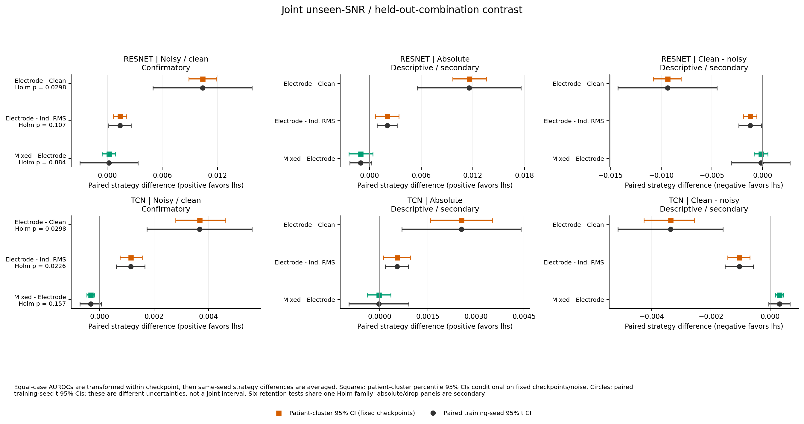

## 4. Clean 性能及代价

| 模型 | 策略 | AUROC | AP | F1 | Brier ↓ | ECE ↓ |
| --- | --- | --- | --- | --- | --- | --- |
| resnet | clean-only | 0.9072 ± 0.0019 | 0.7836 ± 0.0060 | 0.7159 ± 0.0048 | 0.0962 ± 0.0024 | 0.0448 ± 0.0076 |
| resnet | independent-RMS | 0.9085 ± 0.0010 | 0.7874 ± 0.0028 | 0.7194 ± 0.0032 | 0.0945 ± 0.0028 | 0.0397 ± 0.0101 |
| resnet | electrode | 0.9093 ± 0.0006 | 0.7868 ± 0.0023 | 0.7205 ± 0.0018 | 0.0934 ± 0.0015 | 0.0372 ± 0.0076 |
| resnet | mixed | 0.9081 ± 0.0015 | 0.7843 ± 0.0040 | 0.7188 ± 0.0027 | 0.0969 ± 0.0023 | 0.0493 ± 0.0083 |
| tcn | clean-only | 0.9177 ± 0.0026 | 0.8073 ± 0.0040 | 0.7390 ± 0.0072 | 0.0906 ± 0.0025 | 0.0487 ± 0.0076 |
| tcn | independent-RMS | 0.9174 ± 0.0027 | 0.8065 ± 0.0042 | 0.7400 ± 0.0089 | 0.0913 ± 0.0039 | 0.0496 ± 0.0130 |
| tcn | electrode | 0.9169 ± 0.0026 | 0.8057 ± 0.0041 | 0.7388 ± 0.0071 | 0.0914 ± 0.0034 | 0.0495 ± 0.0112 |
| tcn | mixed | 0.9172 ± 0.0030 | 0.8065 ± 0.0043 | 0.7395 ± 0.0064 | 0.0919 ± 0.0036 | 0.0520 ± 0.0116 |

所有 ± 为五个训练 seed 的样本 SD，不是置信区间。

| 模型 | 策略 | clean AUROC 代价 | clean AP 代价 | clean F1 代价 |
| --- | --- | --- | --- | --- |
| resnet | clean-only | 0.0000 ± 0.0000 | 0.0000 ± 0.0000 | 0.0000 ± 0.0000 |
| resnet | independent-RMS | -0.0014 ± 0.0011 | -0.0038 ± 0.0042 | -0.0035 ± 0.0037 |
| resnet | electrode | -0.0022 ± 0.0021 | -0.0031 ± 0.0042 | -0.0046 ± 0.0030 |
| resnet | mixed | -0.0010 ± 0.0016 | -0.0007 ± 0.0047 | -0.0029 ± 0.0034 |
| tcn | clean-only | 0.0000 ± 0.0000 | 0.0000 ± 0.0000 | 0.0000 ± 0.0000 |
| tcn | independent-RMS | 0.0003 ± 0.0004 | 0.0008 ± 0.0005 | -0.0010 ± 0.0031 |
| tcn | electrode | 0.0008 ± 0.0004 | 0.0016 ± 0.0003 | 0.0002 ± 0.0016 |
| tcn | mixed | 0.0005 ± 0.0006 | 0.0008 ± 0.0006 | -0.0005 ± 0.0027 |

正代价表示比同 seed 的 clean-only 更差。AUROC 的条件患者区间与逐 seed 值见图及完整 patient_ci.csv；没有临床非劣界值，不能自动称代价可接受。

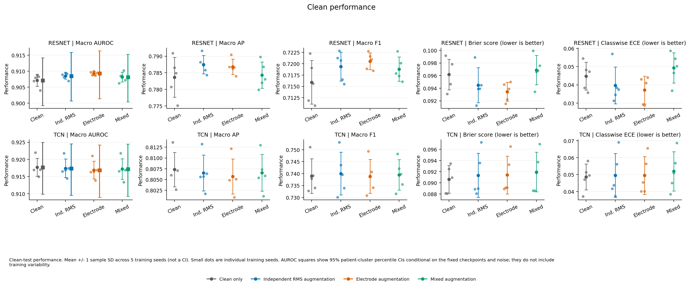

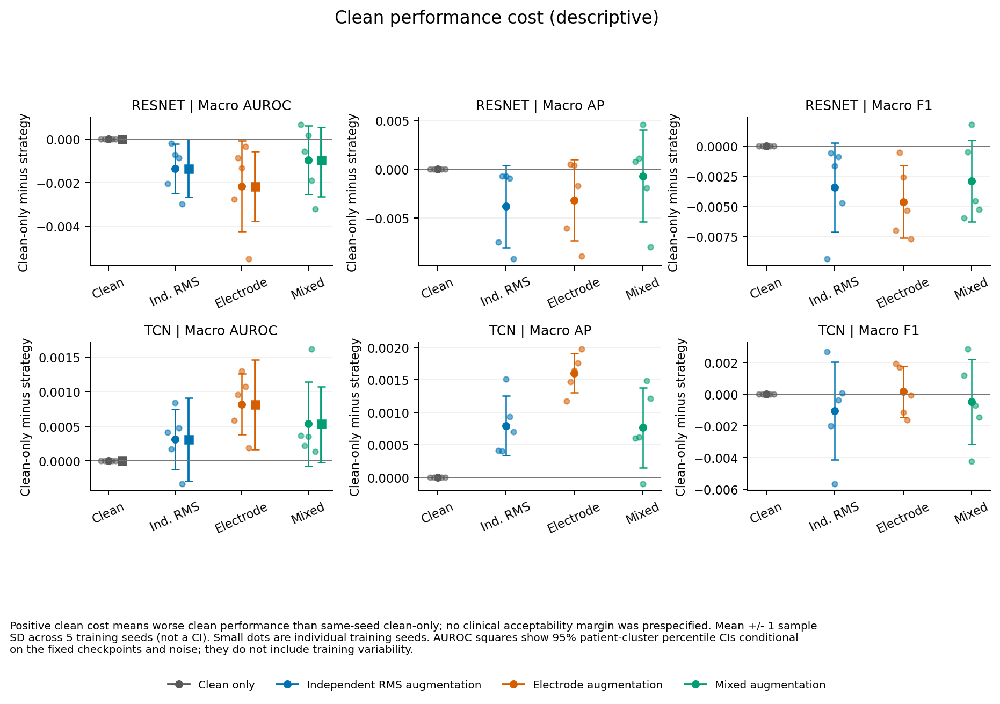

## 5. 分离未见强度与未见组合

未见强度：使用训练组合支持，检查 15/5 dB；未见组合：使用十个 held-out 组合，检查训练已见的 20/10 dB。这样不把两个变化混为同一个问题。下列为次要描述性配对差，不增加事后 p 值。

| 模型 | 分解问题 | dB | 比较 | ΔAUROC | ΔAP | Δretention | AUROC 正向 seed |
| --- | --- | --- | --- | --- | --- | --- | --- |
| resnet | 未见强度 | 15 | electrode − clean-only | 0.0037 | 0.0058 | 0.0017 | 5/5 |
| resnet | 未见强度 | 15 | electrode − independent-RMS | 0.0009 | -0.0005 | 0.0001 | 4/5 |
| resnet | 未见强度 | 5 | electrode − clean-only | 0.0160 | 0.0269 | 0.0153 | 5/5 |
| resnet | 未见强度 | 5 | electrode − independent-RMS | 0.0017 | 0.0018 | 0.0010 | 5/5 |
| resnet | 未见组合 | 20 | electrode − clean-only | 0.0028 | 0.0041 | 0.0007 | 5/5 |
| resnet | 未见组合 | 20 | electrode − independent-RMS | 0.0009 | -0.0005 | 0.0001 | 4/5 |
| resnet | 未见组合 | 10 | electrode − clean-only | 0.0080 | 0.0133 | 0.0064 | 5/5 |
| resnet | 未见组合 | 10 | electrode − independent-RMS | 0.0015 | 0.0010 | 0.0008 | 5/5 |
| tcn | 未见强度 | 15 | electrode − clean-only | -0.0007 | -0.0016 | 0.0001 | 1/5 |
| tcn | 未见强度 | 15 | electrode − independent-RMS | -0.0005 | -0.0009 | -0.0000 | 0/5 |
| tcn | 未见强度 | 5 | electrode − clean-only | 0.0034 | 0.0065 | 0.0046 | 5/5 |
| tcn | 未见强度 | 5 | electrode − independent-RMS | 0.0004 | 0.0010 | 0.0010 | 5/5 |
| tcn | 未见组合 | 20 | electrode − clean-only | -0.0008 | -0.0018 | -0.0000 | 0/5 |
| tcn | 未见组合 | 20 | electrode − independent-RMS | -0.0005 | -0.0009 | -0.0000 | 0/5 |
| tcn | 未见组合 | 10 | electrode − clean-only | 0.0006 | 0.0009 | 0.0015 | 4/5 |
| tcn | 未见组合 | 10 | electrode − independent-RMS | -0.0002 | -0.0004 | 0.0003 | 1/5 |

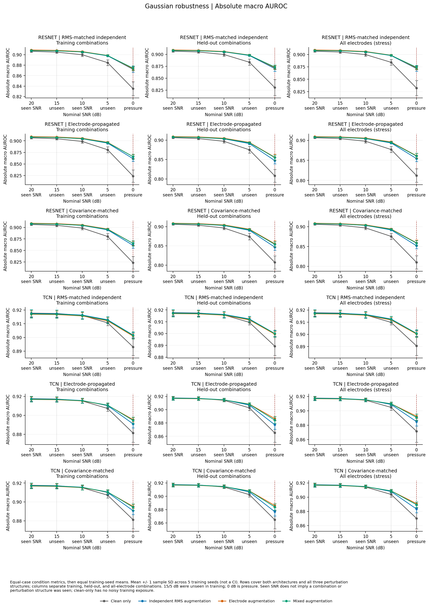

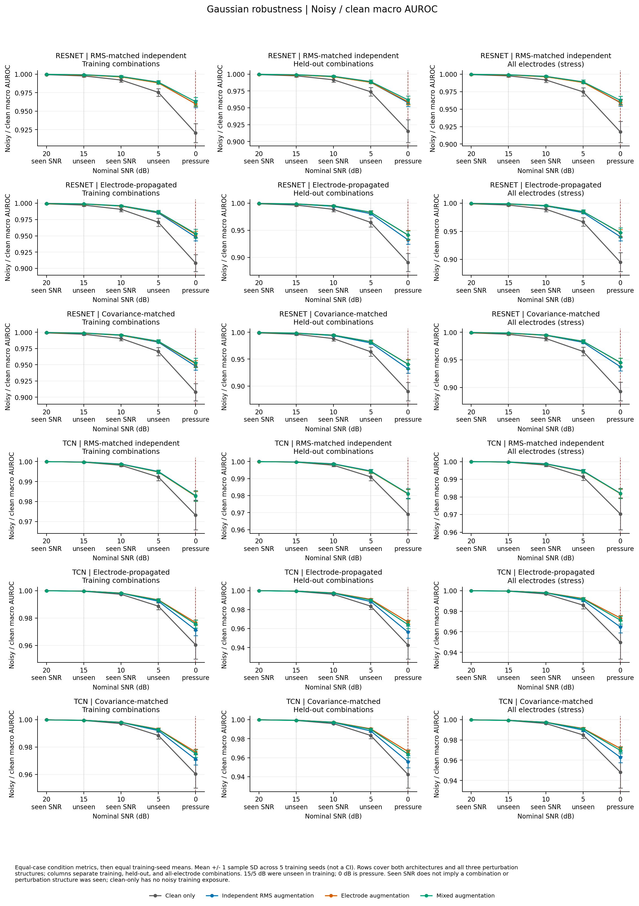

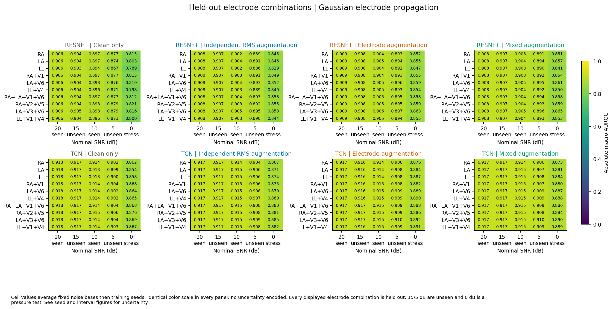

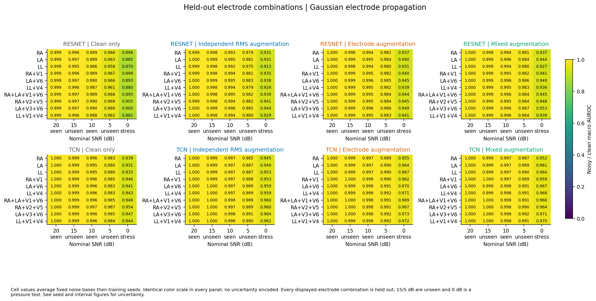

协方差匹配分支为机制消融参照，independent-RMS 控制逐导联能量和零支持。单胸电极条件本身不产生跨多导联相关结构，不能仅靠这类条件判断协方差机制。所有结构/组合/SNR 的原始指标均保存，不只展示有利条件。

| 模型 | 测试结构 | dB | electrode−independent ΔAUROC | Δretention | 正向 seed |
| --- | --- | --- | --- | --- | --- |
| resnet | independent_rms | 15 | 0.0007 | -0.0001 | 3/5 |
| resnet | independent_rms | 5 | 0.0009 | 0.0001 | 4/5 |
| resnet | electrode | 15 | 0.0010 | 0.0003 | 4/5 |
| resnet | electrode | 5 | 0.0030 | 0.0025 | 5/5 |
| resnet | covariance | 15 | 0.0010 | 0.0002 | 4/5 |
| resnet | covariance | 5 | 0.0030 | 0.0024 | 5/5 |
| tcn | independent_rms | 15 | -0.0006 | -0.0001 | 0/5 |
| tcn | independent_rms | 5 | -0.0008 | -0.0003 | 0/5 |
| tcn | electrode | 15 | -0.0005 | -0.0000 | 0/5 |
| tcn | electrode | 5 | 0.0016 | 0.0023 | 5/5 |
| tcn | covariance | 15 | -0.0005 | -0.0000 | 0/5 |
| tcn | covariance | 5 | 0.0016 | 0.0023 | 5/5 |

## 6. 分类、阈值与校准辅助指标

### Clean

| 模型 | 策略 | Micro-AUROC | Micro-AP | Micro-F1 | Brier ↓ | ECE ↓ |
| --- | --- | --- | --- | --- | --- | --- |
| resnet | clean-only | 0.9168 ± 0.0032 | 0.8172 ± 0.0069 | 0.7490 ± 0.0045 | 0.0962 ± 0.0024 | 0.0448 ± 0.0076 |
| resnet | independent-RMS | 0.9204 ± 0.0027 | 0.8235 ± 0.0063 | 0.7522 ± 0.0026 | 0.0945 ± 0.0028 | 0.0397 ± 0.0101 |
| resnet | electrode | 0.9214 ± 0.0010 | 0.8264 ± 0.0022 | 0.7536 ± 0.0013 | 0.0934 ± 0.0015 | 0.0372 ± 0.0076 |
| resnet | mixed | 0.9180 ± 0.0035 | 0.8188 ± 0.0054 | 0.7517 ± 0.0022 | 0.0969 ± 0.0023 | 0.0493 ± 0.0083 |
| tcn | clean-only | 0.9273 ± 0.0030 | 0.8410 ± 0.0074 | 0.7695 ± 0.0048 | 0.0906 ± 0.0025 | 0.0487 ± 0.0076 |
| tcn | independent-RMS | 0.9269 ± 0.0041 | 0.8400 ± 0.0100 | 0.7697 ± 0.0064 | 0.0913 ± 0.0039 | 0.0496 ± 0.0130 |
| tcn | electrode | 0.9266 ± 0.0036 | 0.8393 ± 0.0090 | 0.7683 ± 0.0048 | 0.0914 ± 0.0034 | 0.0495 ± 0.0112 |
| tcn | mixed | 0.9261 ± 0.0041 | 0.8381 ± 0.0099 | 0.7694 ± 0.0044 | 0.0919 ± 0.0036 | 0.0520 ± 0.0116 |

| 模型 | 策略 | Sensitivity | Specificity | PPV | NPV | 标签一致率 | 平均概率变化 |
| --- | --- | --- | --- | --- | --- | --- | --- |
| resnet | clean-only | 0.7381 ± 0.0123 | 0.8892 ± 0.0029 | 0.7022 ± 0.0089 | 0.9193 ± 0.0030 | 1.0000 ± 0.0000 | 0.0000 ± 0.0000 |
| resnet | independent-RMS | 0.7402 ± 0.0085 | 0.8904 ± 0.0044 | 0.7033 ± 0.0074 | 0.9204 ± 0.0030 | 1.0000 ± 0.0000 | 0.0000 ± 0.0000 |
| resnet | electrode | 0.7459 ± 0.0121 | 0.8898 ± 0.0053 | 0.7002 ± 0.0089 | 0.9216 ± 0.0020 | 1.0000 ± 0.0000 | 0.0000 ± 0.0000 |
| resnet | mixed | 0.7479 ± 0.0203 | 0.8845 ± 0.0072 | 0.6969 ± 0.0154 | 0.9229 ± 0.0033 | 1.0000 ± 0.0000 | 0.0000 ± 0.0000 |
| tcn | clean-only | 0.7687 ± 0.0234 | 0.8947 ± 0.0095 | 0.7179 ± 0.0175 | 0.9288 ± 0.0062 | 1.0000 ± 0.0000 | 0.0000 ± 0.0000 |
| tcn | independent-RMS | 0.7652 ± 0.0108 | 0.8978 ± 0.0052 | 0.7208 ± 0.0080 | 0.9269 ± 0.0036 | 1.0000 ± 0.0000 | 0.0000 ± 0.0000 |
| tcn | electrode | 0.7653 ± 0.0065 | 0.8973 ± 0.0056 | 0.7176 ± 0.0079 | 0.9262 ± 0.0031 | 1.0000 ± 0.0000 | 0.0000 ± 0.0000 |
| tcn | mixed | 0.7744 ± 0.0156 | 0.8927 ± 0.0036 | 0.7116 ± 0.0060 | 0.9296 ± 0.0040 | 1.0000 ± 0.0000 | 0.0000 ± 0.0000 |

### 联合未见主组

| 模型 | 策略 | Micro-AUROC | Micro-AP | Micro-F1 | Brier ↓ | ECE ↓ |
| --- | --- | --- | --- | --- | --- | --- |
| resnet | clean-only | 0.8846 ± 0.0143 | 0.7575 ± 0.0289 | 0.6868 ± 0.0136 | 0.1124 ± 0.0076 | 0.0708 ± 0.0145 |
| resnet | independent-RMS | 0.9061 ± 0.0068 | 0.7958 ± 0.0142 | 0.7282 ± 0.0069 | 0.1020 ± 0.0041 | 0.0496 ± 0.0141 |
| resnet | electrode | 0.9117 ± 0.0022 | 0.8081 ± 0.0046 | 0.7350 ± 0.0062 | 0.0988 ± 0.0019 | 0.0421 ± 0.0061 |
| resnet | mixed | 0.9082 ± 0.0038 | 0.7993 ± 0.0088 | 0.7335 ± 0.0063 | 0.1016 ± 0.0017 | 0.0520 ± 0.0066 |
| tcn | clean-only | 0.9086 ± 0.0118 | 0.8081 ± 0.0180 | 0.7107 ± 0.0178 | 0.1010 ± 0.0065 | 0.0634 ± 0.0181 |
| tcn | independent-RMS | 0.9196 ± 0.0024 | 0.8263 ± 0.0063 | 0.7377 ± 0.0059 | 0.0950 ± 0.0021 | 0.0501 ± 0.0081 |
| tcn | electrode | 0.9217 ± 0.0025 | 0.8300 ± 0.0067 | 0.7503 ± 0.0062 | 0.0937 ± 0.0023 | 0.0471 ± 0.0094 |
| tcn | mixed | 0.9208 ± 0.0030 | 0.8280 ± 0.0073 | 0.7490 ± 0.0023 | 0.0944 ± 0.0024 | 0.0491 ± 0.0086 |

| 模型 | 策略 | Sensitivity | Specificity | PPV | NPV | 标签一致率 | 平均概率变化 |
| --- | --- | --- | --- | --- | --- | --- | --- |
| resnet | clean-only | 0.7228 ± 0.0190 | 0.8547 ± 0.0132 | 0.6480 ± 0.0138 | 0.9025 ± 0.0059 | 0.9115 ± 0.0121 | 0.0795 ± 0.0071 |
| resnet | independent-RMS | 0.7288 ± 0.0144 | 0.8804 ± 0.0083 | 0.6806 ± 0.0130 | 0.9115 ± 0.0035 | 0.9472 ± 0.0090 | 0.0513 ± 0.0088 |
| resnet | electrode | 0.7361 ± 0.0162 | 0.8803 ± 0.0076 | 0.6825 ± 0.0157 | 0.9155 ± 0.0028 | 0.9542 ± 0.0049 | 0.0433 ± 0.0038 |
| resnet | mixed | 0.7368 ± 0.0197 | 0.8773 ± 0.0093 | 0.6796 ± 0.0189 | 0.9159 ± 0.0029 | 0.9521 ± 0.0074 | 0.0451 ± 0.0063 |
| tcn | clean-only | 0.7657 ± 0.0255 | 0.8603 ± 0.0151 | 0.6612 ± 0.0138 | 0.9153 ± 0.0083 | 0.9173 ± 0.0191 | 0.0703 ± 0.0166 |
| tcn | independent-RMS | 0.7623 ± 0.0129 | 0.8828 ± 0.0075 | 0.6869 ± 0.0049 | 0.9170 ± 0.0054 | 0.9460 ± 0.0077 | 0.0470 ± 0.0053 |
| tcn | electrode | 0.7624 ± 0.0095 | 0.8898 ± 0.0052 | 0.6969 ± 0.0050 | 0.9197 ± 0.0053 | 0.9616 ± 0.0020 | 0.0349 ± 0.0031 |
| tcn | mixed | 0.7731 ± 0.0166 | 0.8822 ± 0.0070 | 0.6865 ± 0.0106 | 0.9229 ± 0.0041 | 0.9586 ± 0.0049 | 0.0368 ± 0.0044 |

Sensitivity/Specificity/PPV/NPV 是五类 macro 比值；若某类分母为 0，macro 保持未定义，并披露有定义训练 seed 数，而不将它填成 0。标签一致率及平均概率变化都相对于同 checkpoint 的 clean 预测。阈值始终来自 clean validation；ECE 和可靠性图没有对 test 拟合校准器。

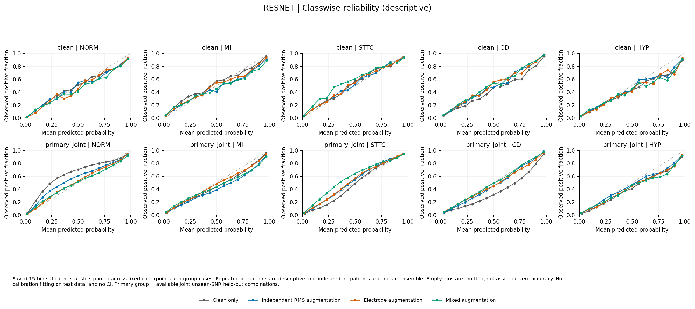

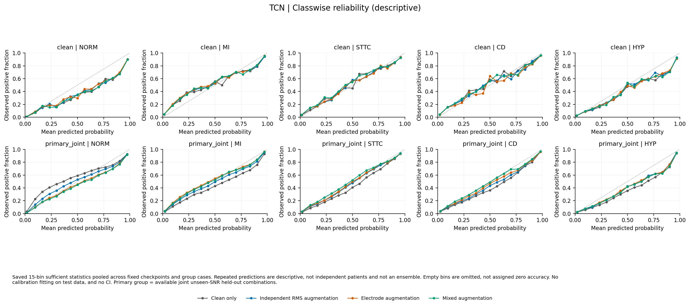

### 6.1 逐类 AUROC / AP / F1

| 条件 | 模型 | 策略 | 类别 | AUROC | AP | F1 |
| --- | --- | --- | --- | --- | --- | --- |
| clean | resnet | clean-only | NORM | 0.9317 ± 0.0032 | 0.9042 ± 0.0066 | 0.8442 ± 0.0039 |
| clean | resnet | clean-only | MI | 0.8895 ± 0.0109 | 0.7632 ± 0.0177 | 0.6892 ± 0.0139 |
| clean | resnet | clean-only | STTC | 0.9226 ± 0.0047 | 0.8046 ± 0.0142 | 0.7438 ± 0.0152 |
| clean | resnet | clean-only | CD | 0.8988 ± 0.0035 | 0.8062 ± 0.0058 | 0.7074 ± 0.0056 |
| clean | resnet | clean-only | HYP | 0.8931 ± 0.0032 | 0.6400 ± 0.0156 | 0.5950 ± 0.0236 |
| clean | resnet | independent-RMS | NORM | 0.9321 ± 0.0026 | 0.9052 ± 0.0059 | 0.8436 ± 0.0054 |
| clean | resnet | independent-RMS | MI | 0.8948 ± 0.0074 | 0.7721 ± 0.0080 | 0.6906 ± 0.0076 |
| clean | resnet | independent-RMS | STTC | 0.9240 ± 0.0037 | 0.8047 ± 0.0119 | 0.7430 ± 0.0078 |
| clean | resnet | independent-RMS | CD | 0.9003 ± 0.0042 | 0.8099 ± 0.0051 | 0.7181 ± 0.0106 |
| clean | resnet | independent-RMS | HYP | 0.8915 ± 0.0042 | 0.6453 ± 0.0085 | 0.6016 ± 0.0120 |
| clean | resnet | electrode | NORM | 0.9335 ± 0.0030 | 0.9072 ± 0.0060 | 0.8483 ± 0.0056 |
| clean | resnet | electrode | MI | 0.8972 ± 0.0056 | 0.7752 ± 0.0071 | 0.7012 ± 0.0066 |
| clean | resnet | electrode | STTC | 0.9215 ± 0.0050 | 0.7966 ± 0.0139 | 0.7399 ± 0.0095 |
| clean | resnet | electrode | CD | 0.9004 ± 0.0046 | 0.8120 ± 0.0080 | 0.7152 ± 0.0093 |
| clean | resnet | electrode | HYP | 0.8940 ± 0.0029 | 0.6430 ± 0.0142 | 0.5981 ± 0.0131 |
| clean | resnet | mixed | NORM | 0.9310 ± 0.0023 | 0.9039 ± 0.0038 | 0.8411 ± 0.0047 |
| clean | resnet | mixed | MI | 0.8941 ± 0.0067 | 0.7674 ± 0.0094 | 0.6948 ± 0.0093 |
| clean | resnet | mixed | STTC | 0.9227 ± 0.0024 | 0.8003 ± 0.0062 | 0.7406 ± 0.0051 |
| clean | resnet | mixed | CD | 0.9011 ± 0.0035 | 0.8128 ± 0.0034 | 0.7282 ± 0.0095 |
| clean | resnet | mixed | HYP | 0.8917 ± 0.0060 | 0.6372 ± 0.0174 | 0.5894 ± 0.0222 |
| clean | tcn | clean-only | NORM | 0.9421 ± 0.0020 | 0.9215 ± 0.0039 | 0.8556 ± 0.0041 |
| clean | tcn | clean-only | MI | 0.9101 ± 0.0036 | 0.7970 ± 0.0108 | 0.7160 ± 0.0048 |
| clean | tcn | clean-only | STTC | 0.9314 ± 0.0032 | 0.8201 ± 0.0056 | 0.7694 ± 0.0077 |
| clean | tcn | clean-only | CD | 0.9104 ± 0.0047 | 0.8326 ± 0.0062 | 0.7400 ± 0.0079 |
| clean | tcn | clean-only | HYP | 0.8946 ± 0.0055 | 0.6654 ± 0.0105 | 0.6140 ± 0.0264 |
| clean | tcn | independent-RMS | NORM | 0.9407 ± 0.0025 | 0.9193 ± 0.0059 | 0.8545 ± 0.0047 |
| clean | tcn | independent-RMS | MI | 0.9100 ± 0.0039 | 0.7972 ± 0.0110 | 0.7155 ± 0.0101 |
| clean | tcn | independent-RMS | STTC | 0.9306 ± 0.0026 | 0.8193 ± 0.0050 | 0.7676 ± 0.0080 |
| clean | tcn | independent-RMS | CD | 0.9111 ± 0.0048 | 0.8328 ± 0.0062 | 0.7422 ± 0.0087 |
| clean | tcn | independent-RMS | HYP | 0.8946 ± 0.0039 | 0.6640 ± 0.0068 | 0.6203 ± 0.0301 |
| clean | tcn | electrode | NORM | 0.9401 ± 0.0026 | 0.9179 ± 0.0060 | 0.8528 ± 0.0042 |
| clean | tcn | electrode | MI | 0.9093 ± 0.0040 | 0.7958 ± 0.0107 | 0.7156 ± 0.0062 |
| clean | tcn | electrode | STTC | 0.9308 ± 0.0023 | 0.8193 ± 0.0045 | 0.7660 ± 0.0062 |
| clean | tcn | electrode | CD | 0.9106 ± 0.0054 | 0.8324 ± 0.0063 | 0.7414 ± 0.0078 |
| clean | tcn | electrode | HYP | 0.8937 ± 0.0034 | 0.6631 ± 0.0072 | 0.6183 ± 0.0257 |
| clean | tcn | mixed | NORM | 0.9402 ± 0.0033 | 0.9184 ± 0.0072 | 0.8550 ± 0.0054 |
| clean | tcn | mixed | MI | 0.9100 ± 0.0037 | 0.7968 ± 0.0110 | 0.7193 ± 0.0097 |
| clean | tcn | mixed | STTC | 0.9302 ± 0.0028 | 0.8188 ± 0.0043 | 0.7664 ± 0.0109 |
| clean | tcn | mixed | CD | 0.9102 ± 0.0052 | 0.8327 ± 0.0060 | 0.7415 ± 0.0055 |
| clean | tcn | mixed | HYP | 0.8952 ± 0.0043 | 0.6661 ± 0.0091 | 0.6151 ± 0.0226 |
| primary_joint | resnet | clean-only | NORM | 0.9169 ± 0.0036 | 0.8817 ± 0.0086 | 0.7570 ± 0.0262 |
| primary_joint | resnet | clean-only | MI | 0.8641 ± 0.0153 | 0.7236 ± 0.0250 | 0.6335 ± 0.0214 |
| primary_joint | resnet | clean-only | STTC | 0.9005 ± 0.0073 | 0.7634 ± 0.0150 | 0.6866 ± 0.0132 |
| primary_joint | resnet | clean-only | CD | 0.8857 ± 0.0033 | 0.7866 ± 0.0063 | 0.6906 ± 0.0054 |
| primary_joint | resnet | clean-only | HYP | 0.8802 ± 0.0061 | 0.6187 ± 0.0209 | 0.5668 ± 0.0219 |
| primary_joint | resnet | independent-RMS | NORM | 0.9236 ± 0.0022 | 0.8928 ± 0.0058 | 0.8178 ± 0.0104 |
| primary_joint | resnet | independent-RMS | MI | 0.8798 ± 0.0070 | 0.7475 ± 0.0085 | 0.6669 ± 0.0098 |
| primary_joint | resnet | independent-RMS | STTC | 0.9136 ± 0.0018 | 0.7835 ± 0.0081 | 0.7185 ± 0.0044 |
| primary_joint | resnet | independent-RMS | CD | 0.8914 ± 0.0041 | 0.7956 ± 0.0044 | 0.7012 ± 0.0078 |
| primary_joint | resnet | independent-RMS | HYP | 0.8865 ± 0.0023 | 0.6378 ± 0.0100 | 0.5946 ± 0.0105 |
| primary_joint | resnet | electrode | NORM | 0.9262 ± 0.0024 | 0.8965 ± 0.0060 | 0.8311 ± 0.0071 |
| primary_joint | resnet | electrode | MI | 0.8844 ± 0.0062 | 0.7541 ± 0.0073 | 0.6774 ± 0.0090 |
| primary_joint | resnet | electrode | STTC | 0.9135 ± 0.0052 | 0.7809 ± 0.0164 | 0.7204 ± 0.0088 |
| primary_joint | resnet | electrode | CD | 0.8916 ± 0.0029 | 0.7982 ± 0.0042 | 0.6996 ± 0.0065 |
| primary_joint | resnet | electrode | HYP | 0.8895 ± 0.0036 | 0.6383 ± 0.0138 | 0.5931 ± 0.0170 |
| primary_joint | resnet | mixed | NORM | 0.9236 ± 0.0022 | 0.8929 ± 0.0034 | 0.8275 ± 0.0083 |
| primary_joint | resnet | mixed | MI | 0.8819 ± 0.0066 | 0.7475 ± 0.0073 | 0.6719 ± 0.0094 |
| primary_joint | resnet | mixed | STTC | 0.9147 ± 0.0020 | 0.7861 ± 0.0041 | 0.7211 ± 0.0062 |
| primary_joint | resnet | mixed | CD | 0.8923 ± 0.0044 | 0.7995 ± 0.0048 | 0.7058 ± 0.0063 |
| primary_joint | resnet | mixed | HYP | 0.8875 ± 0.0029 | 0.6322 ± 0.0110 | 0.5875 ± 0.0167 |
| primary_joint | tcn | clean-only | NORM | 0.9333 ± 0.0028 | 0.9097 ± 0.0059 | 0.7654 ± 0.0562 |
| primary_joint | tcn | clean-only | MI | 0.8991 ± 0.0022 | 0.7767 ± 0.0083 | 0.6748 ± 0.0163 |
| primary_joint | tcn | clean-only | STTC | 0.9242 ± 0.0029 | 0.8064 ± 0.0062 | 0.7216 ± 0.0225 |
| primary_joint | tcn | clean-only | CD | 0.9037 ± 0.0043 | 0.8204 ± 0.0059 | 0.7118 ± 0.0160 |
| primary_joint | tcn | clean-only | HYP | 0.8891 ± 0.0059 | 0.6566 ± 0.0152 | 0.5850 ± 0.0231 |
| primary_joint | tcn | independent-RMS | NORM | 0.9342 ± 0.0027 | 0.9102 ± 0.0062 | 0.8122 ± 0.0194 |
| primary_joint | tcn | independent-RMS | MI | 0.9008 ± 0.0036 | 0.7812 ± 0.0089 | 0.6915 ± 0.0059 |
| primary_joint | tcn | independent-RMS | STTC | 0.9267 ± 0.0024 | 0.8115 ± 0.0047 | 0.7463 ± 0.0110 |
| primary_joint | tcn | independent-RMS | CD | 0.9058 ± 0.0043 | 0.8228 ± 0.0061 | 0.7241 ± 0.0118 |
| primary_joint | tcn | independent-RMS | HYP | 0.8919 ± 0.0034 | 0.6616 ± 0.0089 | 0.6017 ± 0.0248 |
| primary_joint | tcn | electrode | NORM | 0.9347 ± 0.0024 | 0.9106 ± 0.0056 | 0.8327 ± 0.0118 |
| primary_joint | tcn | electrode | MI | 0.9015 ± 0.0040 | 0.7830 ± 0.0105 | 0.6992 ± 0.0040 |
| primary_joint | tcn | electrode | STTC | 0.9276 ± 0.0023 | 0.8123 ± 0.0040 | 0.7530 ± 0.0078 |
| primary_joint | tcn | electrode | CD | 0.9065 ± 0.0047 | 0.8241 ± 0.0056 | 0.7303 ± 0.0064 |
| primary_joint | tcn | electrode | HYP | 0.8919 ± 0.0027 | 0.6625 ± 0.0076 | 0.6068 ± 0.0169 |
| primary_joint | tcn | mixed | NORM | 0.9343 ± 0.0035 | 0.9102 ± 0.0073 | 0.8362 ± 0.0074 |
| primary_joint | tcn | mixed | MI | 0.9019 ± 0.0035 | 0.7828 ± 0.0104 | 0.6979 ± 0.0049 |
| primary_joint | tcn | mixed | STTC | 0.9271 ± 0.0029 | 0.8119 ± 0.0047 | 0.7506 ± 0.0076 |
| primary_joint | tcn | mixed | CD | 0.9060 ± 0.0045 | 0.8240 ± 0.0051 | 0.7288 ± 0.0037 |
| primary_joint | tcn | mixed | HYP | 0.8927 ± 0.0037 | 0.6638 ± 0.0092 | 0.5996 ± 0.0215 |

## 7. 训练、患者、噪声三类不确定性

患者簇 bootstrap 使用固定 seed 20260919 和 2000 次共同抽样，test 有 1877 个患者、2158 条 ECG。抽中一个患者保留其全部 ECG 和抽样重复；所有策略与条件共用相同 multiplicities。已保存每个固定 checkpoint 与固定 seed 指标均值的 AUROC/逐类 AUROC 区间、drop、retention、clean cost 和配对差。

缺类别 draw 保留为 NaN 并计数，绝不补抽；macro 始终要求全部五类。percentile CI 使用有效 draw，并报告有效/无效个数。固定 seed 均值是各模型指标/比值/差值在共同 draw 内的均值，不是先平均概率。

五个测试 noise base 只刻画固定模型的噪声实现敏感性，不视为额外训练。下表先在每个噪声 base 内对训练 seed 的配对 retention 差求均值，再展示五次回放的描述性范围。

| 模型 | 比较 | noise 均值 | noise SD | 范围 | 正向 noise |
| --- | --- | --- | --- | --- | --- |
| resnet | electrode − clean-only | 0.0104 | 0.0003 | [0.0099, 0.0106] | 5/5 |
| resnet | electrode − independent-RMS | 0.0014 | 0.0002 | [0.0010, 0.0017] | 5/5 |
| resnet | mixed − electrode | 0.0002 | 0.0002 | [-0.0000, 0.0005] | 3/5 |
| tcn | electrode − clean-only | 0.0037 | 0.0001 | [0.0036, 0.0037] | 5/5 |
| tcn | electrode − independent-RMS | 0.0011 | 0.0000 | [0.0011, 0.0012] | 5/5 |
| tcn | mixed − electrode | -0.0003 | 0.0000 | [-0.0004, -0.0003] | 0/5 |

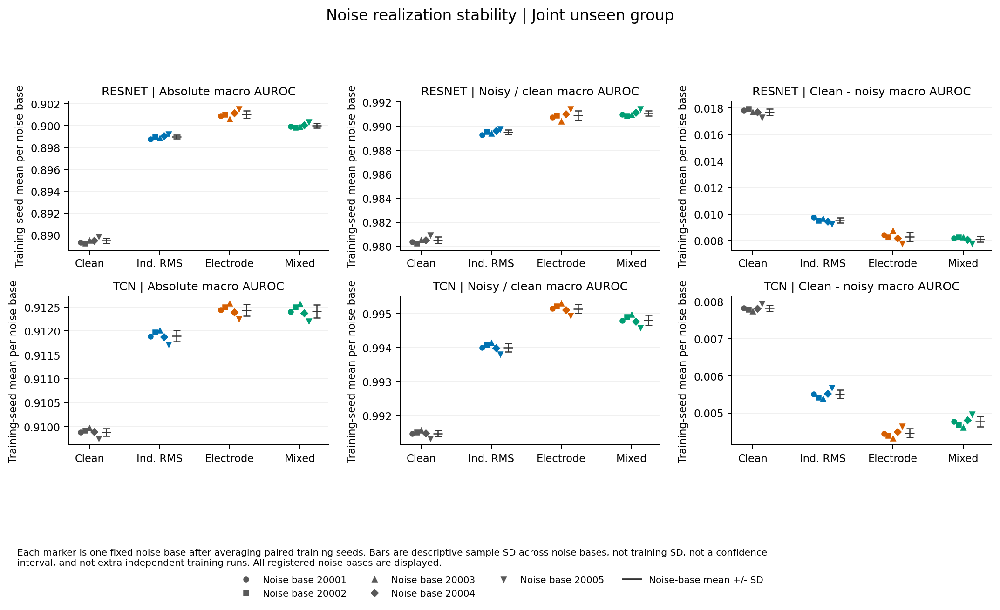

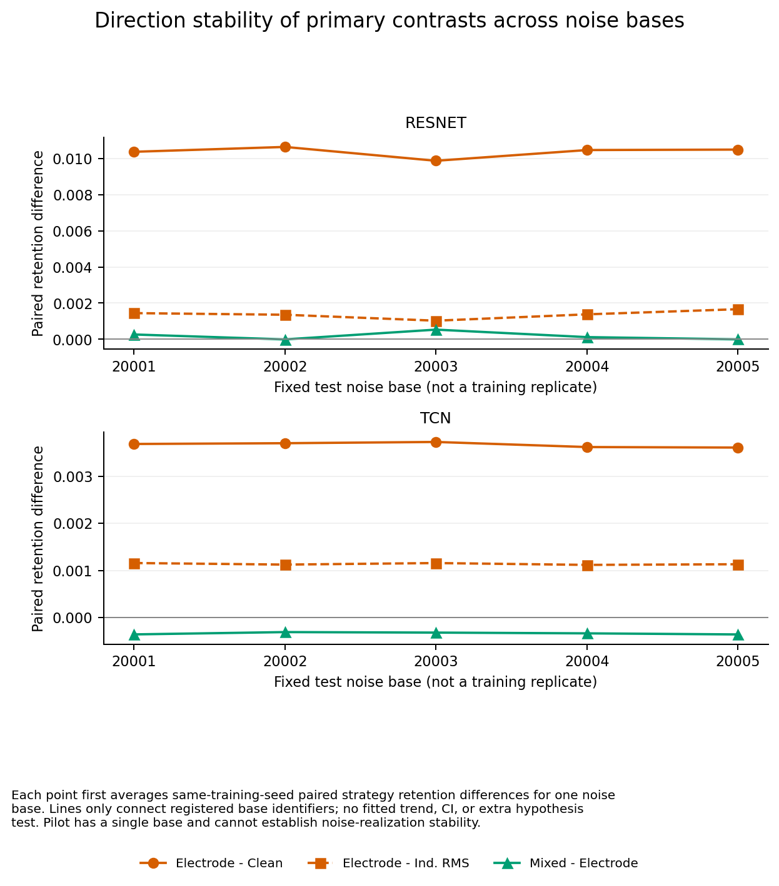

## 8. 四策略排名及描述性一致性

| 模型 | 条件 | 指标 | 策略 | 平均 rank | rank SD |
| --- | --- | --- | --- | --- | --- |
| resnet | clean | macro_ap | clean-only | 3.00 | 1.00 |
| resnet | clean | macro_ap | electrode | 2.40 | 0.55 |
| resnet | clean | macro_ap | independent-RMS | 1.40 | 0.89 |
| resnet | clean | macro_ap | mixed | 3.20 | 1.30 |
| resnet | clean | macro_auroc | clean-only | 3.60 | 0.55 |
| resnet | clean | macro_auroc | electrode | 1.40 | 0.89 |
| resnet | clean | macro_auroc | independent-RMS | 2.40 | 0.55 |
| resnet | clean | macro_auroc | mixed | 2.60 | 1.34 |
| resnet | primary_joint | macro_ap | clean-only | 4.00 | 0.00 |
| resnet | primary_joint | macro_ap | electrode | 1.40 | 0.89 |
| resnet | primary_joint | macro_ap | independent-RMS | 2.60 | 0.55 |
| resnet | primary_joint | macro_ap | mixed | 2.00 | 0.71 |
| resnet | primary_joint | macro_auroc | clean-only | 4.00 | 0.00 |
| resnet | primary_joint | macro_auroc | electrode | 1.20 | 0.45 |
| resnet | primary_joint | macro_auroc | independent-RMS | 3.00 | 0.00 |
| resnet | primary_joint | macro_auroc | mixed | 1.80 | 0.45 |
| tcn | clean | macro_ap | clean-only | 1.20 | 0.45 |
| tcn | clean | macro_ap | electrode | 4.00 | 0.00 |
| tcn | clean | macro_ap | independent-RMS | 2.20 | 0.45 |
| tcn | clean | macro_ap | mixed | 2.60 | 0.89 |
| tcn | clean | macro_auroc | clean-only | 1.20 | 0.45 |
| tcn | clean | macro_auroc | electrode | 3.80 | 0.45 |
| tcn | clean | macro_auroc | independent-RMS | 2.20 | 0.84 |
| tcn | clean | macro_auroc | mixed | 2.80 | 0.84 |
| tcn | primary_joint | macro_ap | clean-only | 3.80 | 0.45 |
| tcn | primary_joint | macro_ap | electrode | 1.40 | 0.55 |
| tcn | primary_joint | macro_ap | independent-RMS | 3.20 | 0.45 |
| tcn | primary_joint | macro_ap | mixed | 1.60 | 0.55 |
| tcn | primary_joint | macro_auroc | clean-only | 3.80 | 0.45 |
| tcn | primary_joint | macro_auroc | electrode | 1.60 | 0.55 |
| tcn | primary_joint | macro_auroc | independent-RMS | 3.00 | 0.71 |
| tcn | primary_joint | macro_auroc | mixed | 1.60 | 0.89 |

rank=1 为最好；AUROC/AP/F1 越高越好，Brier/ECE 越低越好。表中平均 rank 是逐 seed 排名的均值，不是先平均指标再重新排名。仅四种策略；并列平均排名、Spearman/Kendall 均作描述性用途。常量排名导致未定义相关时不填零。

| 模型 | 指标 | clean/主组 Spearman | Kendall |
| --- | --- | --- | --- |
| resnet | brier | 0.400 | 0.333 |
| resnet | ece | 0.800 | 0.667 |
| resnet | macro_ap | 0.400 | 0.333 |
| resnet | macro_auroc | 0.800 | 0.667 |
| resnet | macro_f1 | 0.800 | 0.667 |
| tcn | brier | -0.800 | -0.667 |
| tcn | ece | -0.400 | -0.333 |
| tcn | macro_ap | -0.400 | -0.333 |
| tcn | macro_auroc | -1.000 | -1.000 |
| tcn | macro_f1 | -0.400 | -0.333 |

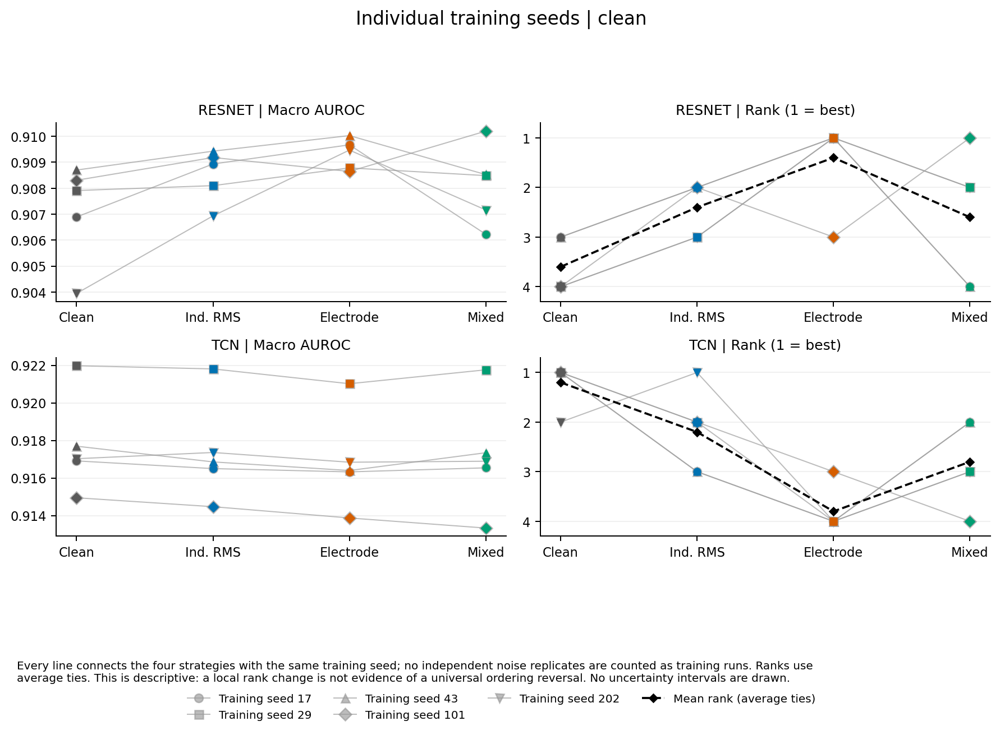

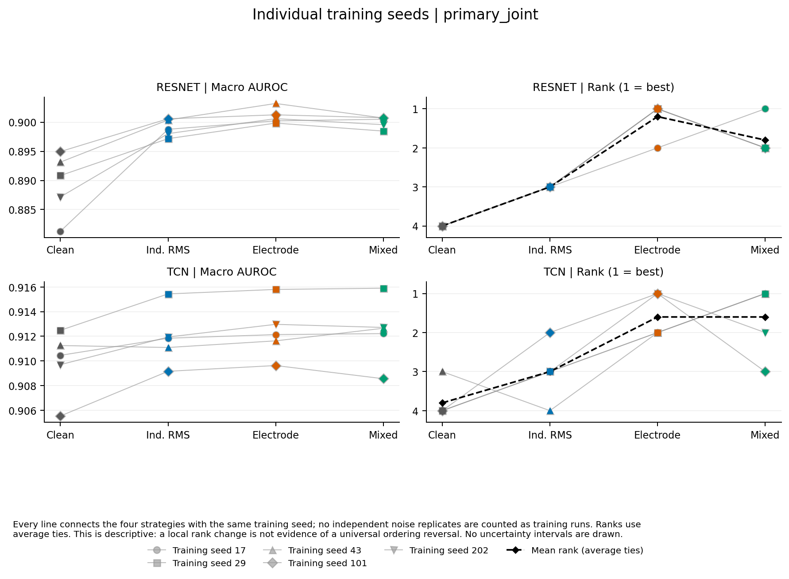

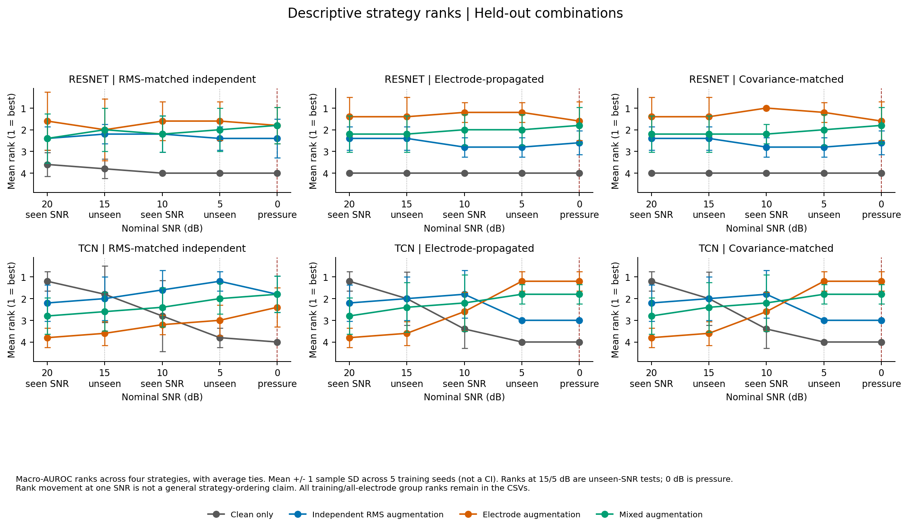

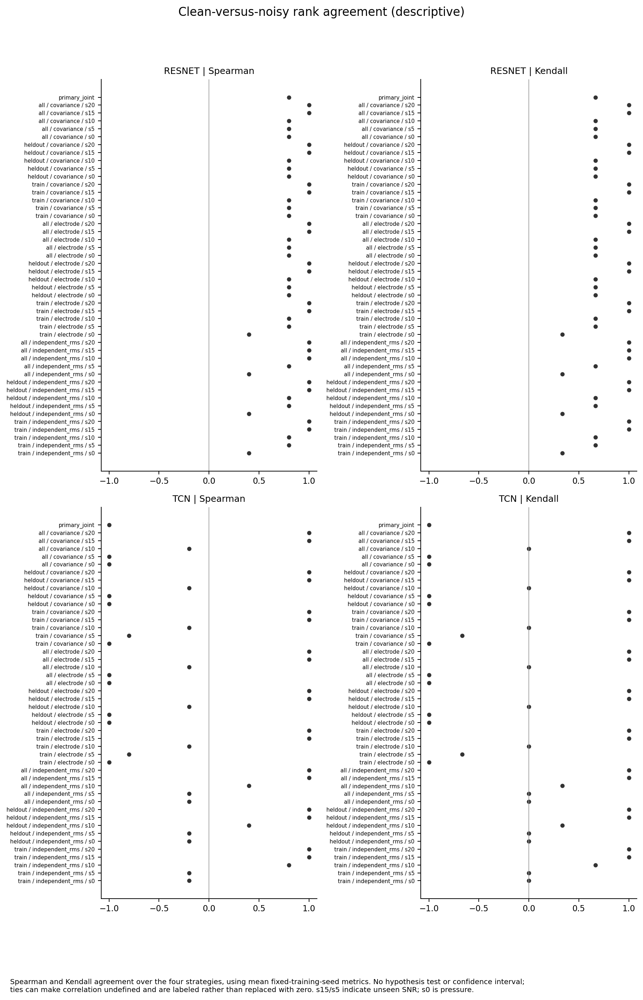

## 9. NSTDB：探索性、有混杂的敏感性分析

bw/ma/em 是真实记录噪声源，但这里将导联空间记录重新用于电极扰动。源/记录域不匹配、全电极压力支持与 Gaussian 主条件不同，因此不是独立的真实采集因果验证。0 dB 单列压力；不能用其替换不显著的预注册主终点。

| 模型 | 类型 | dB | 比较 | ΔAUROC | ΔAP | Δretention | AUROC 正向 seed |
| --- | --- | --- | --- | --- | --- | --- | --- |
| resnet | bw | 20 | electrode − clean-only | 0.0021 | 0.0032 | -0.0000 | 4/5 |
| resnet | bw | 20 | electrode − independent-RMS | 0.0009 | -0.0005 | 0.0001 | 4/5 |
| resnet | bw | 10 | electrode − clean-only | 0.0023 | 0.0035 | 0.0002 | 4/5 |
| resnet | bw | 10 | electrode − independent-RMS | 0.0009 | -0.0006 | 0.0001 | 3/5 |
| resnet | bw | 0（压力） | electrode − clean-only | 0.0041 | 0.0064 | 0.0021 | 5/5 |
| resnet | bw | 0（压力） | electrode − independent-RMS | -0.0002 | -0.0020 | -0.0011 | 2/5 |
| resnet | ma | 20 | electrode − clean-only | 0.0021 | 0.0031 | -0.0000 | 4/5 |
| resnet | ma | 20 | electrode − independent-RMS | 0.0008 | -0.0007 | 0.0000 | 4/5 |
| resnet | ma | 10 | electrode − clean-only | 0.0031 | 0.0050 | 0.0010 | 4/5 |
| resnet | ma | 10 | electrode − independent-RMS | 0.0009 | -0.0006 | 0.0001 | 4/5 |
| resnet | ma | 0（压力） | electrode − clean-only | 0.0103 | 0.0167 | 0.0090 | 5/5 |
| resnet | ma | 0（压力） | electrode − independent-RMS | 0.0008 | -0.0001 | -0.0000 | 3/5 |
| resnet | em | 20 | electrode − clean-only | 0.0023 | 0.0035 | 0.0001 | 5/5 |
| resnet | em | 20 | electrode − independent-RMS | 0.0009 | -0.0005 | 0.0001 | 4/5 |
| resnet | em | 10 | electrode − clean-only | 0.0035 | 0.0056 | 0.0014 | 5/5 |
| resnet | em | 10 | electrode − independent-RMS | 0.0012 | 0.0003 | 0.0004 | 5/5 |
| resnet | em | 0（压力） | electrode − clean-only | 0.0104 | 0.0148 | 0.0092 | 5/5 |
| resnet | em | 0（压力） | electrode − independent-RMS | 0.0011 | 0.0005 | 0.0004 | 3/5 |
| tcn | bw | 20 | electrode − clean-only | -0.0007 | -0.0013 | 0.0002 | 1/5 |
| tcn | bw | 20 | electrode − independent-RMS | -0.0005 | -0.0007 | 0.0000 | 0/5 |
| tcn | bw | 10 | electrode − clean-only | -0.0001 | -0.0004 | 0.0007 | 1/5 |
| tcn | bw | 10 | electrode − independent-RMS | -0.0004 | -0.0006 | 0.0001 | 0/5 |
| tcn | bw | 0（压力） | electrode − clean-only | 0.0017 | 0.0043 | 0.0028 | 4/5 |
| tcn | bw | 0（压力） | electrode − independent-RMS | 0.0002 | 0.0008 | 0.0007 | 3/5 |
| tcn | ma | 20 | electrode − clean-only | -0.0008 | -0.0015 | 0.0000 | 0/5 |
| tcn | ma | 20 | electrode − independent-RMS | -0.0005 | -0.0008 | 0.0000 | 0/5 |
| tcn | ma | 10 | electrode − clean-only | -0.0002 | -0.0006 | 0.0007 | 2/5 |
| tcn | ma | 10 | electrode − independent-RMS | -0.0004 | -0.0007 | 0.0001 | 0/5 |
| tcn | ma | 0（压力） | electrode − clean-only | 0.0041 | 0.0075 | 0.0054 | 5/5 |
| tcn | ma | 0（压力） | electrode − independent-RMS | 0.0010 | 0.0018 | 0.0016 | 5/5 |
| tcn | em | 20 | electrode − clean-only | -0.0008 | -0.0016 | 0.0000 | 0/5 |
| tcn | em | 20 | electrode − independent-RMS | -0.0005 | -0.0008 | 0.0000 | 0/5 |
| tcn | em | 10 | electrode − clean-only | -0.0003 | -0.0007 | 0.0006 | 2/5 |
| tcn | em | 10 | electrode − independent-RMS | -0.0002 | -0.0004 | 0.0003 | 2/5 |
| tcn | em | 0（压力） | electrode − clean-only | 0.0061 | 0.0102 | 0.0075 | 5/5 |
| tcn | em | 0（压力） | electrode − independent-RMS | 0.0051 | 0.0078 | 0.0061 | 5/5 |

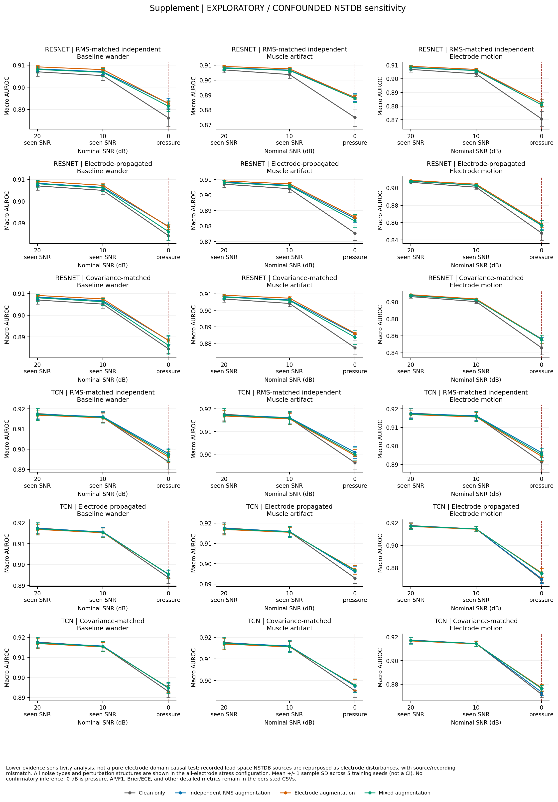

## 10. 技术 pilot、执行异常与独立验收

Pilot：4,000 / 1,000 / 1,000 条，seed 17，8 次训练各 10 epochs；118 个共享 case、944 份预测、2000 次患者簇抽样、18 组 PNG/PDF。技术门控只检查固定预算、曝光、噪声强度、流/组合分离及产物，不选择优胜策略，也不改变 full 设置。

第一次监督任务退出码为 58，没有 Python traceback；当时 full 首次 clean-only/ResNet/seed17 仅记录到第17轮。确认没有残留子进程后，保留原尝试日志并从相同注册初始化重新训练完整25轮；后续采用可跨监督会话存续的进程。没有将部分运行充作已完成模型，也没有调整训练预算。所有尝试以 run_status.json 为准。

独立验收核对 68440 份预测哈希；对 clean 和全部主条件独立用 sklearn 重算 4040 组 AUROC/AP/F1，最大绝对误差分别为 1.11e-16 / 0 / 0。显式复制被抽中患者全部 ECG 的复算覆盖 2424 个 condition×draw；逐项重算六个主对比、t 区间、患者区间及 Holm。

对全部 40 个 checkpoint 的 clean 与一个主条件各128条记录重新推理（cuda），最大概率差 0。所有训练 epoch、数据/输入缓存、表格与图源指纹核对；完整图形文件完成解码、PDF头检查及独立目视检查。详见验收 JSON，不把窄范围 smoke 冒充全矩阵验收。

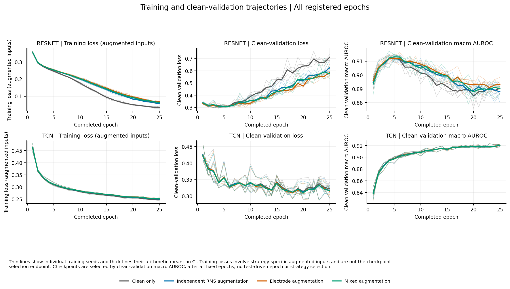

## 11. 推断边界

该研究比较的是固定 PTB-XL 划分、两种网络、固定训练预算和明确噪声机制下的采集扰动泛化。合成 Gaussian、电极理想映射和 NSTDB 重用不包含全部真实设备、阻抗、饱和、非线性或临床分布转移。五个训练 seed 的 t 推断样本仍小；患者区间不含训练随机性；五次噪声不是五次独立训练。没有独立外部临床验证。

结论需要同时对照 clean、绝对 noisy 性能、retention、两模型方向和全部训练 seed。不得将局部最好结果、未校正次要比较或探索性 NSTDB 结果升级为普适训练优越性。

## 12. 复现与原始交付

命令及目录见 [README](../README.md)。核心来源：

- [预注册](../results/logs/preregistration.json)；[运行历史](../results/logs/run_status.json)；[实现修订说明](../results/logs/implementation_amendments.json)。

- [完整原始指标](../results/tables/full/metrics.csv)；[每训练 seed 组指标](../results/tables/full/group_seed_metrics.csv)；[均值/SD/t区间](../results/tables/full/seed_summary.csv)。

- [主比较](../results/tables/full/primary_comparisons.csv)；[配对效应](../results/tables/full/paired_effects.csv)；[患者区间](../results/tables/full/patient_ci.csv)；[无效 draw 计数](../results/tables/full/bootstrap_invalid_summary.csv)。

- [患者抽样及分布索引](../results/tables/full/patient_bootstrap/manifest.json)；[测试输入索引](../results/test_inputs/full/manifest.json)；[图及源表索引](../results/figures/full/figure_manifest.json)。

- [完整独立验收](../results/logs/full/independent_verification.json)；[pilot 独立验收](../results/logs/pilot/independent_verification.json)；[目视检查](../results/logs/visual_review.json)；[第一阶段保护复核](../results/logs/phase1_preservation_verified.json)。

补充图：[未见组合 AP/F1](../results/figures/full/supplement_gaussian_heldout_ap_f1.png)、[Brier/ECE](../results/figures/full/supplement_gaussian_heldout_brier_ece.png)。所有图同时提供同名 PDF。
